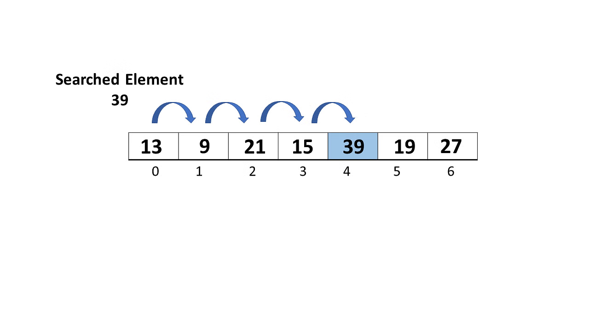
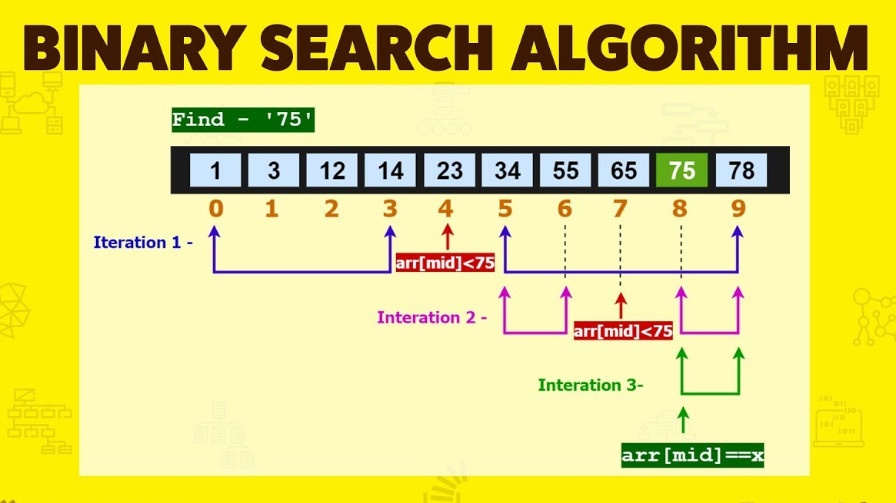
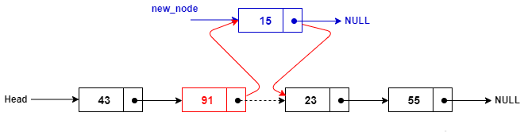
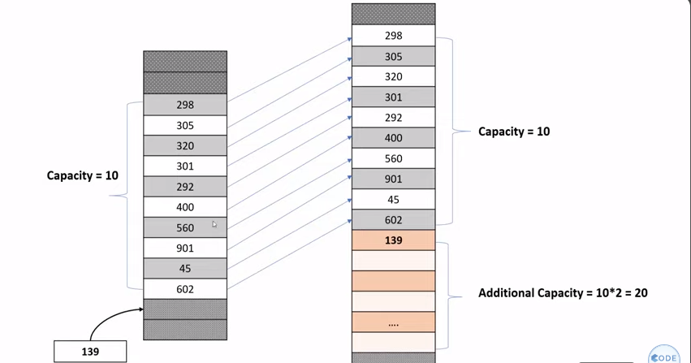
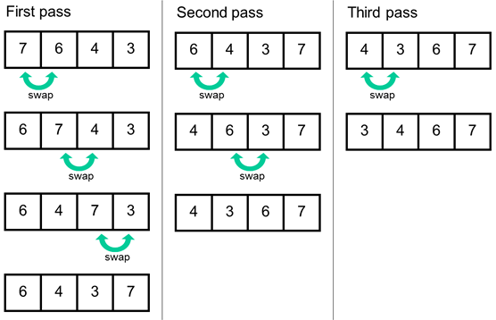

# All about Data Structure Algorithms with Real-time example

<br>
<p align="center"></p>

## Linear Search

Linear search, also known as sequential search, is a simple search algorithm that checks each element in a list or array until the target element is found or the entire list is traversed. It starts searching from the beginning of the list and compares each element with the target element until a match is found or the end of the list is reached.



### Realtime Example Linear Search

A real-time example of linear search could be searching for a specific contact in your phone's contact list.

Imagine you have a list of contacts stored in your phone, and you want to find the contact information for a particular person, let's say "John Doe". You could use linear search to look through each contact in your list one by one until you find the contact named "John Doe".

## Binary Search

Binary search is a searching algorithm that efficiently finds the position of a target value within a sorted array. It works by repeatedly dividing the search interval in half. Here's how it works:

1. Initial Step: Binary search requires the array to be sorted initially. Let's say you have a sorted array arr.

2. Divide: Start with the whole array. Calculate the midpoint of the array.

3. Compare: Compare the target value with the element at the midpoint. If the target value matches the midpoint value, the search is successful.

4. Adjust Search Range: If the target value is less than the midpoint value, then the target, if present, must be in the lower half of the array. If the target value is greater, then it must be in the upper half.

5. Repeat: Repeat steps 2-4 until the target value is found or until the search interval is empty.



### Realtime Example Binary Search

A real-life example of binary search can be found in a library catalogue system.

Imagine you are searching for a particular book in a library with thousands of books arranged in alphabetical order by title. Instead of starting from the first book and checking each book sequentially, which could take a long time especially in a large library, you can use binary search.

## Linked List

Linked list consists of a sequence of elements called nodes. Each node contains two parts: the data and a reference (or pointer) to the next node in the sequence. Linked lists offer dynamic memory allocation, efficient insertion and deletion operations, and are especially useful when the size of the data structure is unknown or frequently changing.



### Why Linked List

For eg: Let's assume we have a list of elements in array

```python
list=[1,2,3,4,5,6,7,8,9,.......,1000000]
```

If we want to insert element in between, all numbers next to the insertion elements will be shifted further.  
Suppose, If we have 1 million of elements in the array (this may take a long time to shift).
Also this increases the time complexity.

LinkedList algorithm stores elements with the address of next node.  
So it doesn't need to shift any nodes while inserting or deleting an element from the middle of
elements.

### Realtime Example Linked List

Let's consider a real-life example of a linked list: a playlist in a music streaming application.

In a music streaming application like Spotify or Apple Music, a playlist is essentially a collection of songs that users can organize and listen to in a particular order. We can represent a playlist using a linked list data structure.

Node Representation:
Each node in the linked list represents a song in the playlist. It contains two parts:

Data: Information about the song, such as the song title, artist, album, duration, etc.
Reference: A reference to the next song in the playlist.
Playlist Structure:

The playlist starts with the first song (the head of the linked list).
Each song is linked to the next song in the playlist through the "next" reference.
The last song in the playlist points to None, indicating the end of the playlist.
Operations:

Adding a Song: To add a new song to the playlist, we create a new node and update the reference of the last song to point to the new song.  
Deleting a Song: To remove a song from the playlist, we adjust the references of the neighboring nodes to bypass the deleted node.  
Playing Songs: We can traverse the linked list from the beginning (head) to the end, playing each song in the playlist sequentially.  
Reordering Songs: We can easily rearrange the playlist by modifying the references between nodes without moving the actual song data.

## Stack

Stack is a linear data structure that follows the Last In, First Out (LIFO) principle. This means that the last element added to the stack is the first one to be removed. Think of it as a stack of plates where you can only remove the top plate or add a new plate on top.


### Using List as a Stack in Python

```python
s=[]
s.append("https://google.com")
s.append("https://google.com/facebook")
s.append("https://google.com/feeds")
s.append("https://google.com/photos")
print(s)
print(s.pop())
print(s.pop())
print(s)
```

In python we can use List as stack, but the problem is that List is dynamic array.
Lets take an example, If we have a list with capacity of 10
for suppose if you have to insert 11th element in the List
but the capacity was 10
Since, it is dynamic array it will create new array with capacity of 10*2 and copy all existing element to new memory and add 11th element.
as shown in below figure

Lets, assume if we have million elements and to add one more element.
it will utilize more resources to copy into new array.



**Therefore, using List as Stack in python is not recommended.**

Recommended approach is to use [collections.deque](https://www.geeksforgeeks.org/deque-in-python/) instead.

### Real time example of Stack

A real-life example of a stack in the context of web pages can be seen in the browser's history mechanism.

Browser History Mechanism:
When you visit web pages using a web browser, each page you visit is added to a history stack. The browser keeps track of the sequence of pages you have visited, and you can navigate through them using the browser's back and forward buttons.

Navigation:

When you visit a new page, it gets pushed onto the top of the history stack.
If you click the browser's back button, the current page is popped off the stack, and you are taken to the previous page.
If you click the forward button, the next page in the stack is popped, and you move forward in the browsing history.
Stack Structure:

Each page visited is analogous to an element in the stack.
When you navigate back, you are essentially popping the top page off the stack and moving to the page beneath it.
When you navigate forward, you are popping the page you previously went back from.
Implementation:

Browsers typically implement the history stack using a data structure similar to a stack, where pages are added to the top (pushed) when visited and removed from the top (popped) when navigating back or forward.

## Bubble sort

Bubble Sort is a simple sorting algorithm that repeatedly steps through the list, compares adjacent elements, and swaps them if they are in the wrong order. The pass through the list is repeated until the list is sorted. It is called Bubble Sort because with each pass through the list, the smaller elements gradually "bubble" up to their correct positions.

Here's how Bubble Sort works:

1. Comparison: The algorithm compares each pair of adjacent items in the list, from the beginning to the end.

2. Swap: If the elements are in the wrong order (i.e., the current element is greater than the next element), they are swapped.

3. Iteration: This process is repeated for each pair of adjacent elements in the list until no more swaps are needed, indicating that the list is sorted.



### Real time example of Bubble sort

let's consider a real-life example where Bubble Sort might be used: sorting a hand of playing cards.

Imagine you have a hand of playing cards that are in a random order, and you want to arrange them in ascending order based on their values (e.g., from Ace to King for each suit).

1. Comparison: To sort the cards, you would compare adjacent cards in the hand.

2. Swap: If the current card is greater than the next card, you would swap their positions.

3. Iteration: You would repeat this process multiple times, traversing the hand of cards, until the entire hand is sorted.
