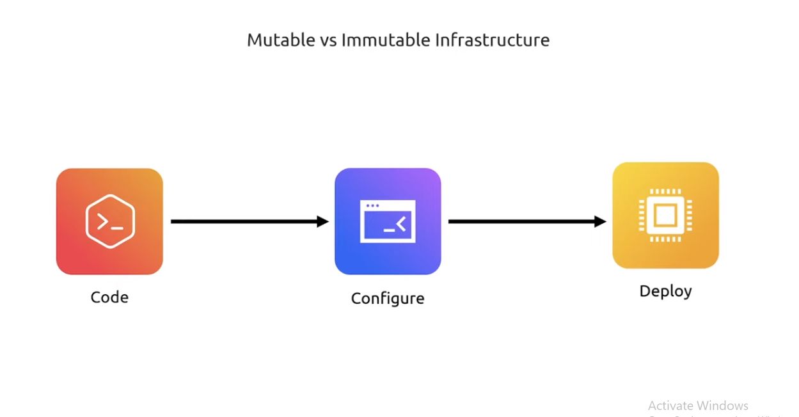
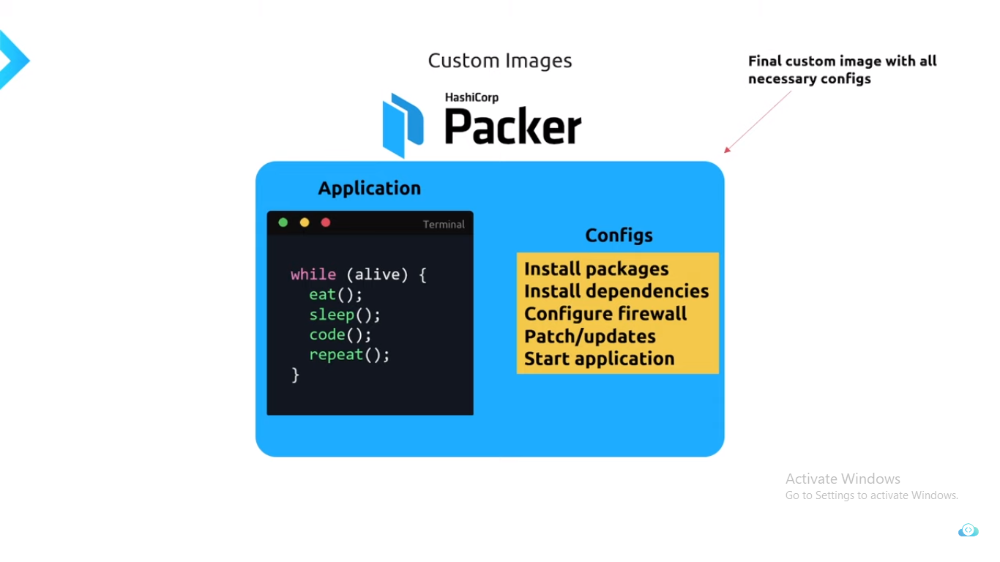

# DevOps Tools

## Docker


### What is Docker?

Docker is a software development tool and a virtualization technology that makes it easy to develop, deploy, and manage applications by using containers. A container refers to a lightweight, stand-alone, executable package of a piece of software that contains all the libraries, configuration files, dependencies, and other necessary parts to operate the application.

#### Docker VS Virtual Machine

* Architecture of Operating System


#### Usage of Docker over Virtual Machine

* docker use system's OS kernel
* where as Virtual MAchine creates its own OS Kernel in users system (it allocate CPU,RAM more compare to docker)


#### Advantages of using Docker over VMs

* Lightweight
* Faster boot up time
- Resource efficient
- Security

### What is Container

1. Container is a way of packing application along with some dependencies, specific version and necessary configuration.  
2. This can be portable i.e (easily share and move).  
3. So where this containers stored??  
    This can be upload/stored in Repositories (Docker Hub, Global Quay)

### How application runs Before using docker Containers


1. Installation process different (for windox-.exe, ububut-.zip/tar file)
2. Due to Different OS (file wont execute)


### After Containers

 (copy from docker tutorial folder)

1. Own Isolated Environment
2. Can install necessary pacakages and dependencies
3. Run the application without worrying about the underlying infrastructure.
4. Lightweight as compared to Virtual Machines.
5. Faster than VMs because of sharing resources with other containers.
6. Security - No need for installing software on server, just pull from repository.
7. Resource Efficient - Only what you need.
8. Portability - You can run it anywhere.

### Docker Image Command

```text
docker build command: It will build Docker images by using the Dockerfile.  
docker pull command: Docker pull command will pull the Docker image whcih is avalible in the dockerhub.  
docker images command: It will list all the images which are pulled and build in the docker host.  
docker inspect command: It will helps to debug the docker image if any errors occurred while building an image or pulling the image.  
docker push command: Docker command will push the docker image into the Dockerhub.  
docker save command: It will save the docker image in the form of dockerfile.  
docker rmi command: It will remove the docker image.  
```

### Docker Container Command

```text
docker attach command: Connecting to an Existing Container
docker ps command: To list the running containers.  
docker container inspect infinite Command: To Inspect the Docker containers.  
docker exec command: To execute the commands in the running containers.  
docker cp command: To copy the file from docker host to the docker containers
```

## Demo (use flask application)


1. Run application in local system 
2. Create a Dockerfile mount the application
3. Create a Docker Image
4. Push Image to Global Quay
5. Pull Image
6. Execute command


## Packer

### What is Packer?

Packer is a tools which help to create customize Image from multiple platform from a single source configuration.


### Stages of Packer


### Usage of Packer

* Well there are to stages of create Images > Mutable and Immutable
* Mutable means changing Continuosly.
* Immutable means needs to configure only one time.
* Mutable is old way to configure the Images.
* Where it needs to cofingure after deploying the application 
* If any case, we want to deploy to multiple server, configure multiple server individually may create new bugs.
* Where as Packer use Immutable, which is configure deploy deplying to server.
* Using single configure Image we can spin up multiple server.

#### Mutable

```DEPLOY > SERVER > CONFIGURE```


Configuring after spinning up server, If any case we need to install dependency into that server
we need to isntall it each individual server, which can lead to issues and Bugs.


#### Immutable

```DEPLOY > CONFIGURE > SERVER```



In Immutable Deploying and Configuration is done before hosting to server



In Immutable using One Packer we can spin up multiple server


