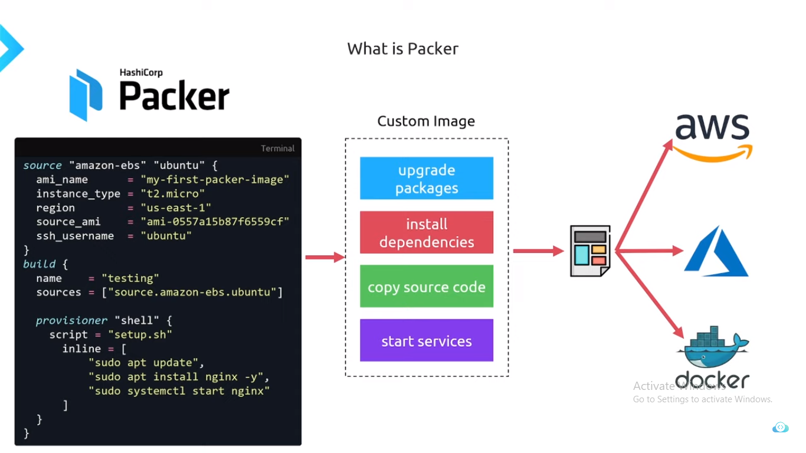
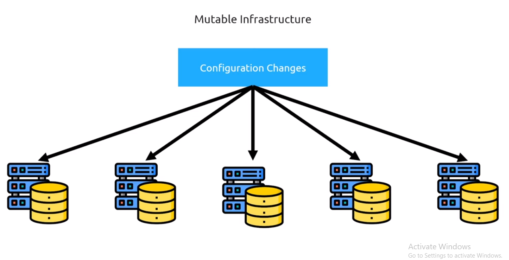

# DevOps Tools

<br>
<p align="center"></p>

## Docker

### What is Docker?

Docker is a software development tool and a virtualization technology that makes it easy to develop, deploy, and manage applications by using containers. A container refers to a lightweight, stand-alone, executable package of a piece of software that contains all the libraries, configuration files, dependencies, and other necessary parts to operate the application.

#### Docker VS Virtual Machine

* Architecture of Operating System


#### Usage of Docker over Virtual Machine

* docker use system's OS kernel
* where as Virtual MAchine creates its own OS Kernel in users system (it allocate CPU,RAM more compare to docker)


#### Advantages of using Docker over VMs

* Lightweight
* Faster boot up time
* Resource efficient
* Security

### What is Container

1. Container is a way of packing application along with some dependencies, specific version and necessary configuration.  
2. This can be portable i.e (easily share and move).  
3. So where this containers stored??  
    This can be upload/stored in Repositories (Docker Hub, Global Quay)

### How application runs Before using docker Containers


1. Installation process different (for window-.exe, ubuntu-.zip/tar file)
2. Due to Different OS (file wont execute)

### After Containers


1. Own Isolated Environment
2. Can install necessary packages and dependencies
3. Run the application without worrying about the underlying infrastructure.
4. Lightweight as compared to Virtual Machines.
5. Faster than VMs because of sharing resources with other containers.
6. Security - No need for installing software on server, just pull from repository.
7. Resource Efficient - Only what you need.
8. Portability - You can run it anywhere.

### Docker Image Command

```text
docker build command: It will build Docker images by using the Dockerfile.  
docker pull command: Docker pull command will pull the Docker image which is available in the docker-hub.  
docker images command: It will list all the images which are pulled and build in the docker host.  
docker inspect command: It will helps to debug the docker image if any errors occurred while building an image or pulling the image.  
docker push command: Docker command will push the docker image into the Docker hub.  
docker save command: It will save the docker image in the form of dockerfile.  
docker rmi command: It will remove the docker image.  
```

### Docker Container Command

```text
docker attach command: Connecting to an Existing Container
docker ps command: To list the running containers.  
docker container inspect infinite Command: To Inspect the Docker containers.  
docker exec command: To execute the commands in the running containers.  
docker cp command: To copy the file from docker host to the docker containers
```

### Demo (use flask application)


1. Run application in local system
2. Create a Dockerfile mount the application
3. Create a Docker Image
4. Push Image to Global Quay
5. Pull Image
6. Execute command

## Packer

### What is Packer?

Packer is a tools which help to create customize Image from multiple platform from a single source configuration.



### Stages of Packer


### Usage of Packer

* Well there are to stages of create Images > Mutable and Immutable
* Mutable means changing Continuously.
* Immutable means needs to configure only one time.
* Mutable is old way to configure the Images.
* Where it needs to configure after deploying the application
* If any case, we want to deploy to multiple server, configure multiple server individually may create new bugs.
* Where as Packer use Immutable, which is configure deploy deploying to server.
* Using single configure Image we can spin up multiple server.

#### Mutable

```DEPLOY > SERVER > CONFIGURE```


Configuring after spinning up server, If any case we need to install dependency into that server
we need to install it each individual server, which can lead to issues and Bugs.



#### Immutable

```DEPLOY > CONFIGURE > SERVER```


In Immutable Deploying and Configuration is done before hosting to server


In Immutable using One Packer we can spin up multiple server


## Argo-cd

### What is Argo-cd?

Argo CD is a declarative, GitOps continuous delivery tool for Kubernetes. It automates the deployment of the desired application states from Git repositories directly to Kubernetes clusters. Argo CD monitors these repositories for changes, ensuring that the deployed application states match the declared states in the repository.

Key Features:

1. Declarative GitOps: Manages your Kubernetes resources declaratively through Git.

2. Automated Sync: Continuously syncs Kubernetes resources to the desired state defined in Git.

3. Visibility: Provides a web UI and CLI for monitoring and managing application deployments.

4. Rollback and Roll Forward: Easy rollbacks and roll forwards to any git commit.

5. Multi-Cluster Management: Can manage applications across multiple clusters.

### Challenges without Argo-cd

Without Argo CD or a similar GitOps tool, managing Kubernetes deployments can present several challenges:

1. Manual Deployment Processes - Error-Prone: Manual deployment steps can introduce human errors. Inconsistent: Different team members might follow slightly different procedures, leading to inconsistencies. Time-Consuming: Manual deployments take more time and can slow down the development cycle.

2. Lack of Single Source of Truth - Configuration Drift: Without a single source of truth, it’s easy for the actual state of the cluster to drift from the desired state.
Difficult Rollbacks: Rolling back to a previous state can be challenging without a clear history of changes.

3. Limited Visibility and Auditing - Poor Traceability: Tracking who made changes, what changes were made, and why can be difficult.
Compliance Issues: Limited visibility can lead to difficulties in ensuring compliance with regulatory requirements.

4. Inconsistent Environments - Environment Parity: Ensuring that different environments (development, staging, production) are consistent can be challenging without automated synchronization.Complex Management: Managing multiple environments manually can become complex and error-prone.

5. Inefficient Resource Management - Resource Wastage: Manual processes can lead to inefficient use of resources, as it’s harder to optimize and automate resource provisioning and scaling.

6. Scalability Issues - Difficulty Scaling: As the number of services and clusters grows, manually managing deployments becomes increasingly difficult and less scalable.
Coordination Overhead: Coordinating deployments across multiple teams and environments can lead to significant overhead.

7. Operational Overheads - Increased Workload: DevOps teams may spend a significant amount of time on repetitive deployment tasks.
Focus Diversion: Teams might be diverted from more strategic tasks to handle operational issues.

8. Slow Incident Recovery - Delayed Response: Manually identifying and resolving issues can delay incident recovery. Lack of Automation: Without automated rollback and recovery processes, downtime can be longer.

Summary
Implementing a tool like Argo CD helps mitigate these challenges by providing automated, consistent, and reliable deployment processes, ensuring a single source of truth, improving visibility and auditing, and enabling efficient resource management and scalability. This leads to faster, safer, and more efficient software delivery.

### Benefits of using Argo-cd

1. Automated Deployments
Continuous Deployment: Argo CD automates the deployment process, ensuring that changes in the Git repository are automatically applied to the Kubernetes cluster.
Synchronization: Keeps your applications in sync with the desired state defined in Git, reducing the chances of configuration drift.

2. Declarative Configuration
Single Source of Truth: The desired state of applications is stored in Git, providing a clear and auditable source of truth.
Version Control: Every change to the configuration is versioned, enabling easy rollbacks and clear change history.

3. Improved Security
Pull-Based Mechanism: Clusters pull configuration changes, reducing the need for direct access to the cluster and thus improving security.
Access Control: Permissions can be managed via Git repository access controls, reducing the need for direct cluster access permissions.

4. Enhanced Visibility and Monitoring
User Interface: Argo CD provides a web UI and CLI for visualizing the state of applications and monitoring deployment status.
Notifications and Alerts: Integration with various notification systems to alert users about the state of deployments.

5. Scalability
Multi-Cluster Management: Manage multiple Kubernetes clusters from a single Argo CD instance.
Scalable Operations: Easily scale deployments across many clusters and environments.

6. Operational Efficiency
Reduced Manual Effort: Automates repetitive deployment tasks, freeing up developers and DevOps teams to focus on more strategic work.
Consistent Environments: Ensures that all environments (development, staging, production) are consistent with each other.

7. Improved Reliability and Resilience
Self-Healing: Automatically detects and corrects drift from the desired state, enhancing the reliability of deployments.
Easy Rollbacks: Simplified rollback to previous application states in case of issues, improving resilience.

8. Compliance and Auditability
Audit Trails: Every change is tracked and logged, providing a complete audit trail of who made changes and why.
Compliance: Helps in meeting compliance requirements by ensuring configurations are consistent and traceable.

9. Flexibility and Extensibility
Custom Plugins: Supports custom resource definitions and can be extended with custom plugins for specific use cases.
Integration: Integrates with other CI/CD tools and workflows, enhancing the overall DevOps pipeline.

10. Community and Ecosystem
Active Community: Argo CD is part of the CNCF and has an active open-source community, ensuring ongoing improvements and support.
Ecosystem: Works well with other tools in the Kubernetes ecosystem, such as Helm, Kustomize, and more.

### Components of Argo-cd


1. API Server
Function: Serves as the central control plane for Argo CD.
Usage:
Exposes the Argo CD API, which can be accessed via CLI, Web UI, or other tools.
Handles all CRUD operations for Argo CD resources such as Applications, Projects, and Repositories.
Manages authentication and authorization.

2. Repository Server
Function: Manages interactions with Git repositories.
Usage:
Fetches and caches Git repository contents.
Serves Git repository information to other Argo CD components, ensuring they have the necessary data to deploy applications.

3. Controller
Function: Watches the state of applications and ensures they are in sync with the desired state defined in Git.
Usage:
Continuously monitors the state of applications in the Kubernetes cluster.
Compares the current state of applications with the desired state from Git.
Executes synchronization operations to reconcile any differences.

4. Application Controller
Function: Manages the lifecycle of Argo CD applications.
Usage:
Tracks application resources and manages their state.
Handles application creation, updates, and deletion.
Manages synchronization and health status reporting.

5. Dex (Optional)
Function: Provides OpenID Connect (OIDC) authentication.
Usage:
Integrates with external identity providers like GitHub, Google, LDAP, etc.
Manages user authentication and provides SSO capabilities.

6. Redis (Optional)
Function: Acts as an in-memory data store.
Usage:
Enhances performance by caching application state and other data.
Optional but recommended for large-scale deployments.

7. Web UI
Function: Provides a graphical interface for interacting with Argo CD.
Usage:
Visualizes the state of applications and their synchronization status.
Allows users to manage applications, view logs, and perform manual synchronization.
Provides a user-friendly way to interact with Argo CD without needing to use the CLI.

8. CLI
Function: Command-line interface for interacting with Argo CD.
Usage:
Enables users to perform all Argo CD operations via the terminal.
Useful for scripting and automation of deployment tasks.
Offers commands to manage applications, projects, and repositories.
