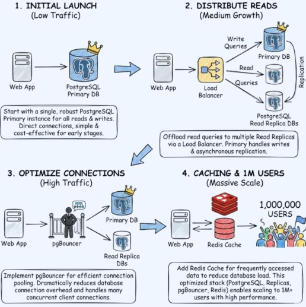

# AWS

## 3 Tier Application


# AWS

## Deploying a 3-Tier Application Architecture in AWS


This guide explains how to deploy a production-style 3-tier architecture in AWS with:

- Route 53
- ACM (SSL)
- VPC (Public & Private Subnets)
- Bastion Host
- RDS MySQL (Multi-AZ)
- Presentation Tier (Frontend)
- Application Tier (Backend)
- Auto Scaling
- CloudWatch Monitoring

---

### 3-Tier Architecture

1. **Presentation Tier**
   - Public ALB
   - EC2 instances (Frontend)

2. **Application Tier**
   - Internal ALB
   - EC2 instances (Backend - Node.js)

3. **Data Tier**
   - RDS MySQL (Multi-AZ)

---

#### 1️⃣ Create Route 53 Hosted Zone

Create Hosted Zone

- Domain Name: xyz.com
- Type:
  - Public Hosted Zone (Public Access)
  - Private Hosted Zone (VPC Only Access)

After creation:

- Copy assigned Name Servers (NS records)
- Go to external domain provider (e.g., GoDaddy)
- Replace existing nameservers with AWS NS values

---

#### 2️⃣ Request Public SSL Certificate (ACM)

Navigate to:

AWS Certificate Manager → Request Certificate

Add domain names:

xyz.com  
xyz.in  

Choose:

DNS Validation

Create validation records in Route 53.

Wait until certificate status shows:

Issued

---

#### 3️⃣ Create VPC and Subnets

VPC Configuration

- Availability Zones: 2
- Public Subnets: 2
- Private Subnets: 4 (2 per AZ)
- NAT Gateway: 1 (single AZ)
- Endpoints: Not used

---

#### 4️⃣ Subnet Configuration

Enable for Public Subnets:

Auto-Assign Public IP → Enabled

Private Subnets:

Auto-Assign Public IP → Disabled

---

#### 5️⃣ Security Groups Configuration

Bastion Host SG

Inbound:
- SSH (22) → Allow from specific IP (Production Best Practice)

---

##### Presentation Layer ALB SG

Inbound:
- HTTP (80) → 0.0.0.0/0

Note: HTTPS can be configured later using CloudFront + ACM.

---

##### Presentation Layer EC2 SG

Inbound:
- SSH (22) → Bastion SG
- HTTP (80) → Presentation ALB SG

---

##### Application Layer ALB SG

Inbound:
- HTTP (80) → Presentation EC2 SG

---

##### Application Layer EC2 SG

Inbound:
- SSH (22) → Bastion SG
- TCP (3200) → Application ALB SG

---

##### Data Tier SG

Inbound:
- MySQL (3306) → Application EC2 SG
- MySQL (3306) → Bastion SG

---

#### 6️⃣ Launch Bastion Host

EC2 → Launch Instance

- AMI → Amazon Linux
- Key Pair → Create new
- VPC → Public Subnet
- Security Group → Bastion SG

---

#### 7️⃣ Create DB Subnet Group

RDS → Subnet Groups → Create

- Select VPC
- Select Private Subnets

---

#### 8️⃣ Create RDS MySQL (Multi-AZ)

RDS → Create Database

- Engine → MySQL
- Deployment → Multi-AZ (Primary + Standby)
- Master Username
- Master Password
- Storage
- VPC
- DB Subnet Group
- Security Group → Data Tier SG

---

#### 9️⃣ Connect to RDS

##### SSH to Bastion

```bash
ssh -i key.pem ec2-user@bastion-public-ip
```

##### Connect to MySQL

```bash
mysql -h <rds-endpoint> -u masteruser -p
```

##### Create App Database & User

```sql
CREATE DATABASE appdb;

CREATE USER 'appuser'@'%' IDENTIFIED BY 'password';

GRANT ALL PRIVILEGES ON appdb.* TO 'appuser'@'%';

FLUSH PRIVILEGES;
```

All application operations should use appuser.

---

#### 🔟 Setup Presentation Tier

##### Create Launch Template

- AMI
- Key Pair
- Public Subnet
- Presentation EC2 SG

##### User Data Script

```bash
#!/bin/bash
yum update -y
yum install nginx -y
systemctl start nginx
systemctl enable nginx

INSTANCE_ID=$(curl http://169.254.169.254/latest/meta-data/instance-id)
PUBLIC_IP=$(curl http://169.254.169.254/latest/meta-data/public-ipv4)

echo "Instance ID: $INSTANCE_ID" > /usr/share/nginx/html/index.html
echo "Public IP: $PUBLIC_IP" >> /usr/share/nginx/html/index.html
```

---

#### 1️⃣1️⃣ Create Presentation Target Group

- Target Type → Instance
- Protocol → HTTP
- Port → 80
- VPC → Select VPC
- Health Check → /

---

#### 1️⃣2️⃣ Create Presentation Load Balancer (Internet Facing)

ALB Configuration:

- Scheme → Internet Facing
- Subnets → Public Subnets
- Security Group → Presentation ALB SG
- Listener → HTTP → Forward to Presentation Target Group

---

#### 1️⃣3️⃣ Create Auto Scaling Group (Presentation Tier)

- Launch Template → Presentation Template
- Subnets → Public
- Attach → Presentation Target Group
- Enable Health Check
- Enable CloudWatch
- Min Capacity → 2
- Max Capacity → 4
- Target CPU Utilization → 50%

---

#### 1️⃣4️⃣ Test Auto Scaling

SSH to Presentation Instance:

```bash
sudo yum install stress -y
stress --cpu 2 --timeout 300
```

Monitor CloudWatch for scaling activity.

---

#### 1️⃣5️⃣ Setup Application Tier

##### Create Launch Template

- Instance Type → t2.micro
- Private Subnet
- Application EC2 SG

##### User Data Script

```bash
#!/bin/bash
yum update -y
yum install git nodejs npm -y

git clone <repository-url>
cd app
npm install

cat <<EOF > .env
DB_HOST=<rds-endpoint>
DB_USER=appuser
DB_PASS=password
DB_NAME=appdb
EOF

npm start
```

---

#### 1️⃣6️⃣ Create Application Target Group

- Target Type → Instance
- Protocol → HTTP
- Port → 3200
- VPC → Select VPC
- Health Check → /

---

#### 1️⃣7️⃣ Create Application Load Balancer (Internal)

- Scheme → Internal
- Subnets → Private Subnets
- Security Group → Application ALB SG
- Listener → HTTP → Forward to Application Target Group

---

#### 1️⃣8️⃣ Create Auto Scaling Group (Application Tier)

- Launch Template → Application Template
- Subnets → Private
- Attach → Application Target Group
- Enable Health Check
- Enable CloudWatch
- Min → 2
- Max → 4
- Target CPU → 50%

---

#### 1️⃣9️⃣ Verify Application EC2

SSH:

Bastion → Application EC2

Check logs:

```bash
cd app
cat logs/app.log
```

---

#### 2️⃣0️⃣ Update Presentation Tier (Frontend)

Create New Launch Template Version.

##### Updated User Data

```bash
#!/bin/bash
yum install git nodejs npm -y

git clone <frontend-repo>
cd frontend
npm install

cat <<EOF > .env
API_URL=http://<internal-application-alb>
DOMAIN=xyz.com
SUBDOMAIN=xyz.in
EOF

npm start
```

Update Launch Template Version in ASG.

---

##### 2️⃣1️⃣ Deploy Latest Version

Auto Scaling → Presentation ASG

- Select Latest Launch Template Version
- Terminate Old Instances

Access:

http://xyz.com

---

#### 2️⃣2️⃣ Setup CloudWatch

##### Create IAM Role

- Attach Policy → CloudWatchLogsFullAccess
- Attach Role → EC2

---

#### 2️⃣3️⃣ Create Log Group

CloudWatch → Log Groups → Create

---

#### 2️⃣4️⃣ Install CloudWatch Agent

```bash
sudo yum install amazon-cloudwatch-agent -y
```

Attach IAM role to EC2 instance.

Configure CloudWatch agent.

---

#### 2️⃣5️⃣ View Logs

CloudWatch → Log Groups

Monitor:

- Application logs
- System logs
- Metrics

---

#### ✅ Final Architecture Flow

Route53  
   ↓  
Public ALB  
   ↓  
Presentation ASG (Public Subnets)  
   ↓  
Internal ALB  
   ↓  
Application ASG (Private Subnets)  
   ↓  
RDS MySQL (Multi-AZ)  

---

#### 🎯 Production Recommendations

- Enable HTTPS (ACM + ALB)
- Use AWS Secrets Manager for DB credentials
- Enable Automated RDS Backups
- Use WAF for security
- Consider CloudFront for CDN
- Implement Infrastructure as Code (Terraform)

---

🚀 You now have a scalable, secure, production-ready 3-tier architecture in AWS.

## Scenario Based Questions

### Read and Write Separate Database (How to scale application to 1M users)



Scaling AWS RDS with Read Replicas in EKS Architecture

I want to understand how database architecture works in AWS.
Suppose I have a web application hosted on AWS with an RDS database, and everything is functioning correctly.

In what scenarios should I use two separate databases — one primary database for write operations and another read replica for read-only operations?

How does this architecture work internally, and how can it be implemented in AWS?

1️⃣ Current Scenario: Single RDS Instance

```bash
Users → ALB → EC2 / EKS → RDS (Single DB)
```

All operations go to one database:

- `SELECT` (Read)
- `INSERT`
- `UPDATE`
- `DELETE`

This works perfectly when:

- Traffic is low to medium
- Read/write ratio is balanced
- Database CPU and connections are within limits

---

#### 🚨 2️⃣ When Do You Need a Separate Write DB and Read Replica?

You introduce **Read Replicas** when scaling read operations becomes necessary.

---

🔹 Condition 1: Heavy Read Traffic

**Example:**

- E-commerce application
- 10,000 users browsing products (reads)
- 500 users placing orders (writes)
- Reads are 20x more than writes

Problem:

- Primary DB overloaded handling `SELECT` queries
- CPU spikes
- Slow queries
- Application performance degradation

👉 **Solution:** Offload read traffic to replicas

---

🔹 Condition 2: Reporting & Analytics Queries

If:

- BI team runs large `SELECT` queries
- Long-running reporting jobs
- Heavy analytical workloads

These queries:

- Lock tables
- Consume CPU
- Impact production users

👉 Run them on a **Read Replica**

---

🔹 Condition 3: Scaling Without Sharding

Instead of vertically scaling (larger DB instance),  
use horizontal scaling with read replicas — often more cost-efficient.

---

#### 🏗 3️⃣ Architecture with Read Replica

```bash
                    ┌────────────┐
                    │  Primary   │
                    │   (Write)  │
                    └─────┬──────┘
                          │
                    Replication
                          │
                ┌─────────┴─────────┐
                │                   │
         ┌────────────┐      ┌────────────┐
         │ Read Replica│      │ Read Replica│
         └────────────┘      └────────────┘
```

#### Application Flow

```bash
App Server
   │
   ├── Write → Primary DB
   │
   └── Read → Read Replica
```

---

🔁 4️⃣ How Read Replica Works Internally

For MySQL / PostgreSQL:

- Asynchronous replication
- Binary logs (binlog)

#### Replication Flow

1. Client writes to Primary DB
2. Primary writes changes to binlog
3. Replica reads binlog
4. Replica applies changes

⚠ **Important:**

- Replication is asynchronous
- Small delay (milliseconds to seconds)
- Called **replication lag**
- Provides *eventual consistency*, not strong consistency

---

#### 🎯 When NOT to Use Read Replicas

❌ Write-heavy workloads  
❌ Applications requiring strict real-time consistency  
❌ Systems that cannot tolerate replication lag  

---

#### 🆚 Multi-AZ vs Read Replica (Critical Difference)

🔹 Multi-AZ

- High Availability
- Standby DB
- Not used for reads
- Automatic failover

🔹 Read Replica

- Used for scaling reads
- Application connects to it
- No automatic failover (unless promoted)

---

⚙ 5️⃣ How to Implement Read Replica in AWS

Option 1: AWS Console

1. Go to RDS
2. Select your database
3. Click **Actions**
4. Choose **Create Read Replica**
5. Select instance size
6. Deploy

---

Option 2: AWS CLI

```bash
aws rds create-db-instance-read-replica \
    --db-instance-identifier mydb-replica \
    --source-db-instance-identifier mydb-primary \
    --db-instance-class db.t3.medium
```

---

Option 3: Terraform (Recommended for DevOps)

```hcl
resource "aws_db_instance" "primary" {
  identifier         = "mydb-primary"
  engine             = "mysql"
  instance_class     = "db.t3.medium"
  allocated_storage  = 20
  username           = "admin"
  password           = "password"
}

resource "aws_db_instance" "replica" {
  identifier          = "mydb-replica"
  replicate_source_db = aws_db_instance.primary.identifier
  instance_class      = "db.t3.medium"
}
```

---

🧠 6️⃣ Application-Level Implementation (Most Important)

AWS does **NOT** automatically split read/write traffic.

Your application must handle it.

### Example (Python Concept)

```python
write_db = connect(primary_endpoint)
read_db = connect(replica_endpoint)

# Write operation
write_db.execute("INSERT INTO users VALUES (...)")

# Read operation
read_db.execute("SELECT * FROM users")
```

---

## 🏢 Real-World Example

**Netflix-like workload:**

- Browse catalog → Read
- Watch list → Read
- Signup → Write
- Like button → Write

If 90% traffic is reads:

```bash
1 Primary
5 Read Replicas
```

---

## 📊 Scaling Strategy

Start simple:

```bash
1 Primary
0 Replica
```

If CPU consistently > 70% due to reads:

```bash
1 Primary
1 Replica
```

As traffic increases:

```bash
1 Primary
3 Replicas
```
