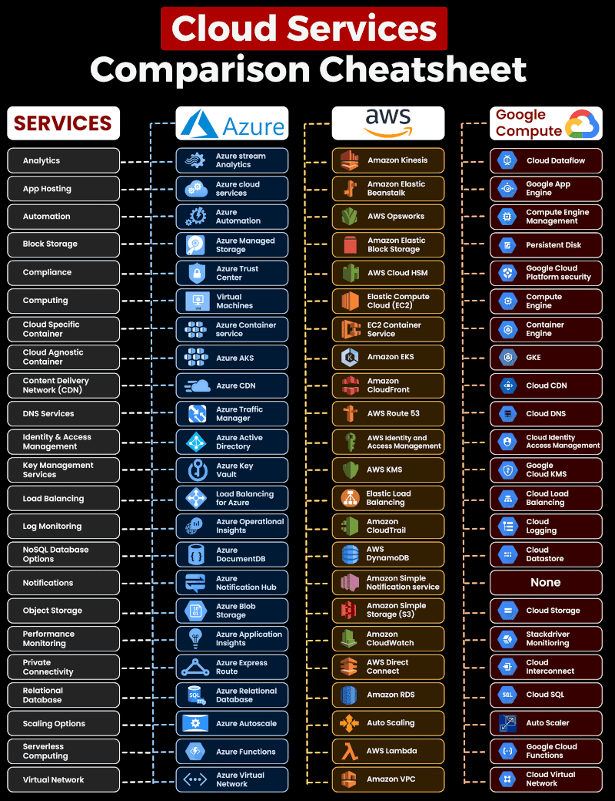

<!-- # Cloud

## Cheat Sheet

### Cloud Comparison

### Azure Cloud Service Cheat Sheet

### Azure Resource Hierarchy

 -->

# Zero to Hero

## Basics of Cloud Computing

### What is Cloud ?

In simpler terms, imagine the cloud as a vast, virtual space where you can store files, run software, and access various services over the internet.

It's like having a powerful computer somewhere out there on the web that you can use for tasks without needing to own or physically manage the hardware. This allows users to access data and applications from anywhere with an internet connection.

### What is Cloud Computing ?

Cloud computing is a technology model that involves the delivery of computing services over the internet. Instead of owning and maintaining physical servers and infrastructure, users can access and use computing resources, applications, and storage provided by either third-party service providers (public cloud) or their own organization (private cloud) through the internet. These services are hosted in data centers located around the world.

In essence, cloud computing can involve both third-party providers (public cloud) and an organization's internal resources (private cloud). The distinction lies in whether the computing resources are shared among multiple customers (public cloud) or dedicated to a single organization (private cloud). The flexibility of cloud computing allows organizations to choose the deployment model that best aligns with their needs and requirements.

### Public Cloud

**Who Uses It:** Everyone, like individuals, businesses, and organizations.

**What It's Like:** Imagine a giant, shared computer space on the internet. It's like using apps, storing files, or doing tasks on the internet that anyone can access.

**Example:** Think of Google Drive or Amazon Web Services (AWS).

### Private Cloud

**Who Uses It:** One specific organization or business.

**What It's Like:** Picture having your own personal, private computer space. It's like a digital clubhouse where only you and your team have access. Others can't just drop in.

**Example:** A company using its own server for all its digital needs.

### Hybrid Cloud

**Who Uses It:** A mix of everyone, depending on needs.

**What It's Like:** It's like having your private computer space, but sometimes you use the shared internet space too.

**Example:** A business storing sensitive data in its private space but using the public cloud for extra storage or specific tasks.

### In a Nutshell

**Public Cloud:** Shared digital space for everyone.

**Private Cloud:** Your own exclusive digital space.

**Hybrid Cloud:** Using both your private space and the shared online space when needed.

## IaaS vs PaaS vs SaaS models in Azure

### Infrastructure as a Service (IaaS)

IaaS is a cloud computing model that provides virtualized computing resources over the internet. In Azure, IaaS offerings include virtual machines, storage, and networking components. Users have more control over the infrastructure but are responsible for managing and maintaining the operating system, middleware, and applications.

#### Key Characteristics of Azure IaaS

- **Scalability:** Easily scale resources up or down based on demand.
  
- **Full Control:** Users have control over the underlying infrastructure, including operating systems and applications.

- **Flexibility:** IaaS is suitable for a wide range of applications, offering flexibility in terms of technology stack.

### Platform as a Service (PaaS)

PaaS is a cloud computing model that provides a platform allowing customers to develop, run, and manage applications without dealing with the complexity of underlying infrastructure. In Azure, PaaS offerings include Azure App Service, Azure SQL Database, and Azure Functions.

#### Key Characteristics of Azure PaaS

- **Simplified Development:** Developers can focus on coding and application logic, while Azure manages the underlying infrastructure.

- **Automatic Scaling:** PaaS offerings often include built-in scaling capabilities, automatically adjusting resources based on demand.

- **Reduced Maintenance:** Azure handles tasks like patching, updates, and maintenance, freeing up resources for innovation.

### Software as a Service (SaaS)

SaaS is a cloud computing model that delivers software applications over the internet. Users can access the software through a web browser without the need for installation or maintenance. In Azure, SaaS offerings include Microsoft 365, Dynamics 365, and many third-party applications.

#### Key Characteristics of Azure SaaS

- **Accessibility:** Access software applications from any device with an internet connection.

- **Managed by Providers:** SaaS providers handle maintenance, updates, and security, reducing the burden on end-users.

- **Subscription-Based:** SaaS applications are typically offered on a subscription basis, allowing users to pay for what they use.

### Choosing the Right Model in Azure

When deciding between IaaS, PaaS, and SaaS in Azure, consider factors such as:

- **Development Needs:** Choose PaaS for streamlined development, IaaS for more control, and SaaS for off-the-shelf solutions.

- **Maintenance Preferences:** If you want to minimize maintenance tasks, opt for PaaS or SaaS.

- **Resource Control:** Choose IaaS if you need more control over the underlying infrastructure.

- **Cost Considerations:** Evaluate pricing models for each service and choose based on your budget and usage patterns.

## Cheat Sheet

### Cloud Comparison

### Azure Cloud Service Cheat Sheet

### Azure Resource Hierarchy

