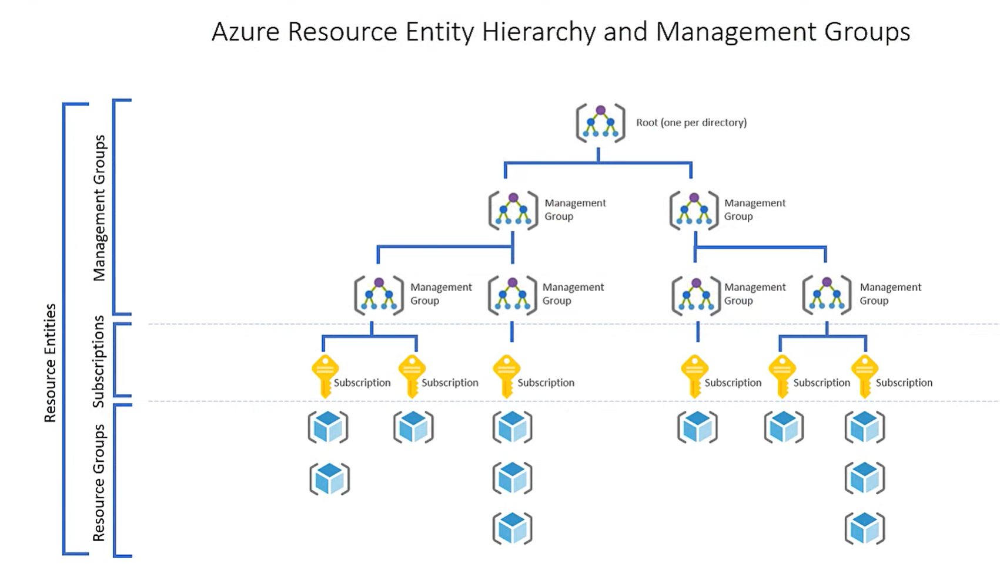

# All about Azure Cloud

## Cloud Computing

### What is Cloud

In simpler terms, imagine the cloud as a vast, virtual space where you can store files, run software, and access various services over the internet.

It's like having a powerful computer somewhere out there on the web that you can use for tasks without needing to own or physically manage the hardware. This allows users to access data and applications from anywhere with an internet connection.

### What is Cloud Computing

Cloud computing is a technology model that involves the delivery of computing services over the internet. Instead of owning and maintaining physical servers and infrastructure, users can access and use computing resources, applications, and storage provided by either third-party service providers (public cloud) or their own organization (private cloud) through the internet. These services are hosted in data centers located around the world.

In essence, cloud computing can involve both third-party providers (public cloud) and an organization's internal resources (private cloud). The distinction lies in whether the computing resources are shared among multiple customers (public cloud) or dedicated to a single organization (private cloud). The flexibility of cloud computing allows organizations to choose the deployment model that best aligns with their needs and requirements.

### Public Cloud

**Who Uses It:** Everyone, like individuals, businesses, and organizations.

**What It's Like:** Imagine a giant, shared computer space on the internet. It's like using apps, storing files, or doing tasks on the internet that anyone can access.

**Example:** Think of Google Drive or Amazon Web Services (AWS).

### Private Cloud

**Who Uses It:** One specific organization or business.

**What It's Like:** Picture having your own personal, private computer space. It's like a digital clubhouse where only you and your team have access. Others can't just drop in.

**Example:** A company using its own server for all its digital needs.

### Hybrid Cloud

**Who Uses It:** A mix of everyone, depending on needs.

**What It's Like:** It's like having your private computer space, but sometimes you use the shared internet space too.

**Example:** A business storing sensitive data in its private space but using the public cloud for hosting web-application or using virtual machines from other cloud providers.

## Cloud Service Models

### Infrastructure as a Service

IaaS is a cloud computing model that provides virtualized computing resources over the internet. In Azure, IaaS offerings include virtual machines, storage, and networking components. Users have more control over the infrastructure but are responsible for managing and maintaining the operating system, middleware, and applications.

#### Key Characteristics of Azure IaaS

- **Scalability:** Easily scale resources up or down based on demand.
  
- **Full Control:** Users have control over the underlying infrastructure, including operating systems and applications.

- **Flexibility:** IaaS is suitable for a wide range of applications, offering flexibility in terms of technology stack.

### Platform as a Service

PaaS is a cloud computing model that provides a platform allowing customers to develop, run, and manage applications without dealing with the complexity of underlying infrastructure. In Azure, PaaS offerings include Azure App Service, Azure SQL Database, and Azure Functions.

#### Key Characteristics of Azure PaaS

- **Simplified Development:** Developers can focus on coding and application logic, while Azure manages the underlying infrastructure.

- **Automatic Scaling:** PaaS offerings often include built-in scaling capabilities, automatically adjusting resources based on demand.

- **Reduced Maintenance:** Azure handles tasks like patching, updates, and maintenance, freeing up resources for innovation.

### Software as a Service

SaaS is a cloud computing model that delivers software applications over the internet. Users can access the software through a web browser without the need for installation or maintenance. In Azure, SaaS offerings include Microsoft 365, Dynamics 365, and many third-party applications.

#### Key Characteristics of Azure SaaS

- **Accessibility:** Access software applications from any device with an internet connection.

- **Managed by Providers:** SaaS providers handle maintenance, updates, and security, reducing the burden on end-users.

- **Subscription-Based:** SaaS applications are typically offered on a subscription basis, allowing users to pay for what they use.

### Choosing the Right Model in Azure

When deciding between IaaS, PaaS, and SaaS in Azure, consider factors such as:

- **Development Needs:** Choose PaaS for streamlined development, IaaS for more control, and SaaS for off-the-shelf solutions.

- **Maintenance Preferences:** If you want to minimize maintenance tasks, opt for PaaS or SaaS.

- **Resource Control:** Choose IaaS if you need more control over the underlying infrastructure.

- **Cost Considerations:** Evaluate pricing models for each service and choose based on your budget and usage patterns.

### IAAS-PAAS-SAAS


## Azure CLI

1. azure cli to get list of secret

```bash
az keyvault secret list --vault-name <key_vault_name> --query "[].id" -o tsv
```

## Azure Resources

Azure resources are the building blocks of your cloud infrastructure in Microsoft Azure. These resources can be virtual machines, databases, storage accounts, or any other service offered by Azure. Each resource is a manageable item in Azure, and they are provisioned and managed individually.

### Resource Groups in Azure

A **Resource Group** in Azure is a logical container for resources that share the same lifecycle, permissions, and policies. It helps you organize and manage related Azure resources efficiently. Resources within a group can be deployed, updated, and deleted together as a single management unit.

#### Key Points about Resource Groups

- **Lifecycle Management:** Resources within a group can be managed collectively, making it easy to handle deployments, updates, and deletions.

- **Resource Organization:** Grouping resources based on projects, environments, or applications helps keep your Azure environment well-organized.

- **Role-Based Access Control (RBAC):** Permissions and access control are applied at the resource group level, allowing you to manage who can access and modify resources within a group.

### Azure Resource Manager (ARM) Overview

**Azure Resource Manager (ARM)** is the deployment and management service for Azure. It provides a consistent management layer that enables you to deploy resources with declarative templates. ARM templates describe the resources you need and their configurations, allowing you to deploy and update resources in a predictable manner.

#### Key Features of Azure Resource Manager

- **Template-Based Deployment:** ARM uses JSON templates to define the infrastructure and configuration of your Azure resources. This enables repeatable and consistent deployments.

- **Dependency Management:** ARM automatically handles dependencies between resources, ensuring they are deployed in the correct order.

- **Rollback and Roll-forward:** In case of deployment failures, ARM can automatically roll back changes to maintain the desired state, or roll forward to the last known good state.

- **Tagging and Categorization:** You can use tags to label and categorize resources, making it easier to manage and organize your Azure environment.

**Note:** Understanding Azure resources, resource groups, and Azure Resource Manager is fundamental to effectively utilize and manage your resources in the Azure cloud.

### Azure Resource Hierarchy



## Virtualization

### Background

In traditional computing, a single physical server runs a single operating system, and applications are installed directly on that OS. This approach has limitations, such as under utilization of hardware resources, difficulty in managing multiple servers, and lack of flexibility in scaling.

**Virtualization** addresses these challenges by introducing a layer of abstraction between the hardware and the operating system. It enables the creation of multiple virtual instances, each running its own operating system and applications, on a single physical server. This technology has become fundamental in modern data centers and cloud computing environments.

### Components of Virtualization

1. **Hypervisor (Virtual Machine Monitor):**
   - The hypervisor is a crucial component of virtualization. It sits between the hardware and the operating systems, managing and allocating resources to virtual machines (VMs).
   - There are two types of hypervisors: Type 1 (bare-metal) runs directly on the hardware, while Type 2 (hosted) runs on top of an existing operating system.

2. **Virtual Machines (VMs):**
   - VMs are the instances created by the hypervisor. Each VM operates as an independent computer with its own virtualized hardware, including CPU, memory, storage, and network interfaces.
   - Multiple VMs can run on a single physical server, allowing for efficient resource utilization.

### Key Concepts in Virtualization

1. **Server Virtualization:**
   - In server virtualization, a physical server is divided into multiple VMs, each running its own OS. This allows for better utilization of hardware resources and easier management of servers.

2. **Resource Pooling:**
   - Virtualization enables the pooling of physical resources, such as CPU, memory, and storage. These resources can be dynamically allocated to VMs based on demand.

3. **Isolation:**
   - VMs operate independently of each other. This isolation ensures that issues in one VM do not affect others, providing a more secure and stable environment.

4. **Snap shotting and Cloning:**
   - Virtualization allows the creation of snapshots, which capture the state of a VM at a specific point in time. This facilitates easy backup and recovery. Cloning enables the rapid duplication of VMs for scalability.

### Types of Virtual Machines on Azure

Azure provides a variety of virtual machine (VM) offerings to cater to different workload requirements. Each VM type is designed with specific hardware configurations to meet diverse performance and scalability needs.

#### General Purpose VMs

Example: **Standard_D2s_v3**

- **Description:** General-purpose VMs are well-balanced machines suitable for a variety of workloads. They offer a good balance of CPU-to-memory ratio and are suitable for development, testing, and small to medium-sized databases.

- **Use Case:** Hosting websites, lightweight applications, or development and testing environments.

#### Compute Optimized VMs

Example: **Standard_F2s_v2**

- **Description:** Compute optimized VMs are designed for compute-intensive workloads that require high CPU power. They provide a high CPU-to-memory ratio, making them suitable for data analytics and computational tasks.

- **Use Case:** Batch processing, gaming applications, and other CPU-intensive workloads.

#### Memory Optimized VMs

Example: **Standard_E16s_v3**

- **Description:** Memory optimized VMs are tailored for memory-intensive applications. They provide a high memory-to-CPU ratio, making them suitable for databases, in-memory caching, and analytics.

- **Use Case:** Running large databases, in-memory caching, and analytics applications.

#### Storage Optimized VMs

Example: **Standard_L8s_v2**

- **Description:** Storage optimized VMs are designed for workloads that require high storage throughput and I/O performance. They provide high local disk throughput, making them suitable for big data and large databases.

- **Use Case:** Big data applications, data warehousing, and large-scale databases.

#### GPU VMs

Example: **Standard_NC6s_v3**

- **Description:** GPU (Graphics Processing Unit) VMs are equipped with powerful graphics processors, suitable for graphics-intensive applications and parallel processing tasks.

- **Use Case:** Machine learning, graphics rendering, and simulations that require GPU acceleration.

#### High-Performance Compute VMs

Example: **Standard_H16r**

- **Description:** High-Performance Compute VMs are designed for demanding, parallel processing and high-performance computing (HPC) applications.

- **Use Case:** Simulations, modeling, and scenarios that require massive parallel processing.

#### Burstable VMs

Example: **B1s**

- **Description:** Burstable VMs provide a baseline level of CPU performance with the ability to burst above the baseline for a certain period. They are cost-effective for workloads with varying CPU usage.

- **Use Case:** Development and testing environments, small websites, and applications with variable workloads. Benefits of Virtualization

1. **Server Consolidation:**
   - Multiple VMs can run on a single physical server, reducing the need for a large number of physical machines. This leads to cost savings and energy efficiency.

2. **Flexibility and Scalability:**
   - Virtualization allows for the easy creation, modification, and scaling of VMs. This flexibility is essential in dynamic computing environments.

3. **Disaster Recovery:**
   - Virtualization simplifies disaster recovery by enabling the quick restoration of VMs from snapshots or backups.

4. **Resource Optimization:**
   - Resources can be allocated and de-allocated dynamically based on workload, optimizing resource utilization.

5. **Testing and Development:**
   - Virtualization provides a sandbox for testing and development. VMs can be easily created, modified, and discarded without affecting the production environment.

## Azure Networking

### Virtual Network

A Virtual Network (VNet) in Azure is a logically isolated network that securely connects Azure resources and extends on-premises networks. 

Key features include:

- **Isolation**: VNets provide isolation at the network level for segmenting resources and controlling traffic.

- **Subnet**: Divide a VNet into subnets for resource organization and traffic control.

- **Address Space**: VNets have an address space defined using CIDR notation, determining the IP address range.

### Subnets and CIDR

**Subnets** : Subnets are subdivisions of a Virtual Network, allowing for better organization and traffic management.

**CIDR (Classless Inter-Domain Routing)** : CIDR notation represents IP addresses and their routing prefix, specifying the range of IP addresses for a network.

### Routes and Route Tables

**Routes** : Routes dictate how network traffic is directed, specifying the destination and next hop.

**Route Tables** : Route Tables are collections of routes associated with subnets, enabling custom routing rules.

### Network Security Groups (NSGs)

NSGs are fundamental for Azure's network security, allow filtering of inbound and outbound traffic.

Key aspects include:

- **Rules**: NSGs define allowed or denied traffic based on source, destination, port, and protocol.

- **Default Rules**: NSGs have default rules for controlling traffic within the Virtual Network and between subnets.

- **Association**: NSGs can be associated with subnets or individual network interfaces.

### Application Security Groups (ASGs)

ASGs group Azure virtual machines based on application requirements, simplifying network security:

- **Simplification**: ASGs allow defining rules based on application roles instead of individual IP addresses.

- **Dynamic Membership**: ASGs support dynamic membership based on tags or other attributes.

- **Rule Association**: Security rules can be associated with ASGs for intuitive and scalable network security management.


## Azure Networking Advanced

### Azure App Gateway & WAF

Azure Application Gateway is a web traffic load balancer that enables you to manage and route traffic to your web applications. Web Application Firewall (WAF) provides protection against web vulnerabilities.

Key features include:

- **Load Balancing**: Distributes incoming traffic across multiple servers to ensure no single server is overwhelmed.

- **SSL Termination**: Offloads SSL processing, improving the efficiency of web servers.

- **Web Application Firewall (WAF)**: Protects web applications from common web vulnerabilities and exploits.

### Azure Load Balancer

Azure Load Balancer distributes incoming network traffic across multiple servers to ensure no single server is overwhelmed.

Key features include:

- **Load Balancing Algorithms**: Supports different algorithms for distributing traffic, such as round-robin and least connections.

- **Availability Sets**: Works seamlessly with availability sets to ensure high availability.

- **Inbound and Outbound Traffic**: Balances both inbound and outbound traffic.

### Azure DNS

Azure DNS is a scalable and secure domain hosting service. It provides name resolution using the Microsoft Azure infrastructure.

Key features include:

- **Domain Hosting**: Hosts domain names and provides name resolution within Azure.

- **Integration with Azure Services**: Easily integrates with other Azure services like App Service and Traffic Manager.

- **Global Availability**: Provides low-latency responses globally.

### Azure Firewall

Azure Firewall is a managed, cloud-based network security service that protects your Azure Virtual Network resources.

Key features include:

- **Stateful Firewall**: Allows or denies traffic based on rules and supports stateful inspection.

- **Application FQDN Filtering**: Filters traffic based on fully qualified domain names.

- **Threat Intelligence Integration**: Integrates with threat intelligence feeds for enhanced security.

### Virtual Network Peering and VNet Gateway

**Virtual Network Peering** : Virtual Network Peering allows connecting Azure Virtual Networks directly, enabling resources in one VNet to communicate with resources in another.

Key features include:

- **Global VNet Peering**: Peering can be established across regions.

- **Transitive Routing**: Traffic between peered VNets flows directly, improving performance.

**VNet Gateway** : VNet Gateway enables secure communication between on-premises networks and Azure Virtual Networks. 

Key features include:

- **Site-to-Site VPN**: Connects on-premises networks to Azure over an encrypted VPN tunnel.

- **Point-to-Site VPN**: Enables secure remote access to Azure resources.

### VPN Gateway

Azure VPN Gateway provides secure, site-to-site connectivity between your on-premises network and Azure.

Key features include:

- **IPsec/IKE VPN Protocols**: Ensures secure communication over the Internet.

- **High Availability**: Supports active-active and active-passive configurations for high availability.

- **BGP Support**: Allows dynamic routing between your on-premises network and Azure.


### DDoS

Azure Distributed Denial of Service (DDoS) Protection safeguards your applications and resources in Azure against DDoS attacks. These attacks aim to overwhelm your application by flooding it with fake traffic, causing slowdowns or making it unavailable to legitimate users.

Azure provides two tiers of DDoS protection:

**Basic** (Default): Enabled automatically for all Azure services, offering protection at the network level.  
**Standard** (Enhanced): Offers advanced mitigation capabilities and is ideal for applications that require higher protection.

Key Features of Azure DDoS Protection

1. Automatic Protection

    Basic Protection: Built into Azure and available for all customers without extra cost.
    Standard Protection: Automatically detects and mitigates threats when a resource (like a virtual network) is under attack.

2. Advanced Threat Detection

    Analyzes traffic patterns to differentiate between legitimate traffic and malicious attacks.
    Protects against various DDoS attack types, such as:  
    Volumetric Attacks: Flood the network with high traffic (e.g., UDP floods).  
    Protocol Attacks: Exploit weaknesses in network protocols (e.g., SYN floods).  
    Resource Layer Attacks: Target the application directly (e.g., HTTP/S floods).

3. Integration with Azure Resources

    Works seamlessly with Azure services like Virtual Networks, Load Balancers, and Application Gateways.  
    Protects applications hosted on Azure without requiring changes to the infrastructure.

4. Cost Protection

    Offers cost protection for scaled resources during an attack.  
    For example, if an attack causes your application to scale up, Azure provides credits for additional resource costs incurred during the attack.

5. Attack Analytics

    Detailed reports and insights are available via Azure Monitor and Log Analytics.  
    You can analyze attack metrics such as:  
    Attack type  
    Attack duration  
    Traffic volume

6. Alerting and Monitoring

    Azure Monitor can trigger alerts when an attack is detected or mitigated.  
    Alerts allow you to stay informed and take additional actions if required.  

7. Easy Configuration

    DDoS Standard protection is enabled by associating it with a Virtual Network (VNet) in your Azure subscription.  
    No complex setup or deployment is required.

**How Azure DDoS Protection Works**

- Traffic Monitoring:

    Azure continuously monitors traffic for anomalies.  
    It uses machine learning and global threat intelligence to detect unusual patterns.

- Attack Detection:

    When abnormal traffic is detected, Azure automatically triggers mitigation.

- Traffic Scrubbing:

    Malicious traffic is filtered out while legitimate traffic continues to flow to your application without disruption.

**Pricing**

DDoS Basic: Free and included with all Azure resources.  
DDoS Standard: Paid, with a flat monthly fee and additional data charges. It is more
cost-effective for mission-critical applications requiring higher protection.

When to Use DDoS Standard?

1. Applications that handle sensitive data or critical workloads.  
2. Public-facing web applications, APIs, or online services.  
3. Resources that require compliance with strict security regulations.  

Benefits of Azure DDoS Protection  

1. Reduced Downtime: Ensures application availability during attacks.  
2. Cost Savings: Provides cost protection during attack-related scaling.  
3. Ease of Use: Seamlessly integrates with Azure resources.  
4. Global Reach: Uses Microsoft's global infrastructure for high availability.

## Storage

### Azure Blob Storage

1. What is it?

    Azure Blob Storage is a cloud-based object storage solution provided by Microsoft Azure.
    It is designed to store and manage large amounts of unstructured data, such as documents, images, videos, and other types of binary and text data.
    Blobs are organized into containers, and each blob is assigned a unique URL for access.

2. When to use it?

    Use Azure Blob Storage when you need to store and retrieve large amounts of unstructured data.
    It is suitable for scenarios like serving images or videos to a website, storing backups, and handling data for analytics and big data processing.

3. Example from DevOps Engineer point of view?

    A DevOps engineer may use Azure Blob Storage to store artifacts and binaries produced during the build process, ensuring a centralized and scalable storage solution.
    Azure Storage Explorer or Azure CLI can be used to automate the uploading and retrieval of artifacts during deployment pipelines.

4. Equivalent service in AWS:

    The equivalent service in AWS is Amazon Simple Storage Service (S3). S3 is also an object storage service designed for scalable and secure storage of objects, such as files and data.

### Azure File Storage

1. What is it?

    Azure File Storage is a fully managed file share service in the cloud.
    It provides the Server Message Block (SMB) protocol for sharing files across applications and VMs in the Azure cloud.
    Azure File Storage is useful for applications that require shared file access, such as configuration files or data files.

2. When to use it?

    Use Azure File Storage when you need a shared file system that can be accessed from multiple VMs or applications.
    It is suitable for scenarios like storing configuration files, sharing data between applications, and serving as a common storage location for applications in a cloud environment.

3. Example from DevOps Engineer point of view?

    A DevOps engineer may leverage Azure File Storage to store configuration files that are shared among multiple application instances.
    In a deployment pipeline, scripts or configuration files stored in Azure File Storage can be mounted to VMs or containers during the deployment process.

4. Equivalent service in AWS:

    The equivalent service in AWS is Amazon Elastic File System (EFS). EFS provides scalable file storage for use with Amazon EC2 instances, supporting the Network File System (NFS) protocol.

### Azure Tables

1. What is it?

    Azure Tables is a NoSQL data store service provided by Azure.
    It stores large amounts of semi-structured data and allows for fast and efficient querying using a key-based access model.
    Data is organized into tables, and each table can store billions of entities.

2. When to use it?

    Use Azure Tables when you need a highly scalable NoSQL data store for semi-structured data with simple key-based access.
    It is suitable for scenarios like storing configuration data, user profiles, and other data where a key-value or key-attribute data model is appropriate.

3. Example from DevOps Engineer point of view?

    A DevOps engineer may use Azure Tables to store configuration settings for applications or services.
    During the deployment process, scripts can retrieve configuration data from Azure Tables to customize the behavior of deployed applications.

4. Equivalent service in AWS:

    While AWS does not have a direct equivalent service for Azure Tables, Amazon DynamoDB is a similar NoSQL database service that provides key-value and document storage. DynamoDB can be used for similar use cases.

### Azure Queue Storage

1. What is it?

    Azure Queue Storage is a message queue service that allows decoupling of components in a distributed application.
    It provides a reliable way to store and retrieve messages between application components, ensuring asynchronous communication.

2. When to use it?

    Use Azure Queue Storage when you need to enable communication and coordination between different parts of a distributed application.
    It is suitable for scenarios like handling background jobs, managing tasks asynchronously, and facilitating communication between loosely coupled components.

3. Example from DevOps Engineer point of view?

    A DevOps engineer may use Azure Queue Storage to implement a message queue for processing background tasks or managing communication between microservices.
    During deployment, scripts can enqueue messages to trigger specific actions or coordinate tasks between different components.

4. Equivalent service in AWS:

    The equivalent service in AWS is Amazon Simple Queue Service (SQS). SQS provides a fully managed message queue service for decoupling components in a distributed system.


### App Service usage


## Azure Managed Identity vs. Service Principal

### Overview

When dealing with authentication and authorization in **Azure**, two key mechanisms are commonly used for securing access to resources: **Managed Identity** and **Service Principal**. Both serve the purpose of enabling secure access to Azure services, but they have different use cases and advantages.

---

### What is a Service Principal?

A **Service Principal** is an identity used by applications, services, or automation scripts to authenticate and access Azure resources. It is created within **Microsoft Entra ID (formerly Azure AD)** and functions similarly to a user account, but for applications.

#### Key Characteristics of SP

- It has **credentials** (client ID & secret or certificate).
- It must be **manually managed** (rotation of secrets, permissions, etc.).
- It can be assigned **RBAC roles** (Role-Based Access Control).
- It can be used in **multi-tenant** scenarios (i.e., across different Azure Active Directory tenants).

#### Use Cases

| Use Case | Description |
|----------|-------------|
| **CI/CD Pipelines** | Used in **Azure DevOps, GitHub Actions, or Jenkins** for deploying applications to Azure resources (e.g., VMs, AKS, App Services). |
| **Third-party applications** | When an **external system** needs to authenticate with Azure, Service Principals provide authentication. |
| **Custom applications** | Applications running **outside Azure** (e.g., on-premises or other cloud providers) can use a Service Principal to authenticate. |
| **Automation scripts** | PowerShell or Python scripts that need to access Azure resources can use a Service Principal for authentication. |

#### How It Works

1. Register an **Application** in **Microsoft Entra ID**.
2. Create a **Service Principal** for this application.
3. Assign it necessary **permissions/RBAC roles**.
4. Use the **Client ID** and **Client Secret/Certificate** for authentication.

#### Challenges

- **Secret Management**: The **client secret** expires and needs rotation.
- **Security Risk**: If credentials are leaked, it can lead to unauthorized access.
- **Manual Setup**: Requires additional configuration and maintenance.

---

### What is Managed Identity

**Azure Managed Identity** is an **automated identity service** provided by Azure that allows Azure resources to authenticate to services securely without needing explicit credential management.

#### Key Characteristics of Manage Identity

- It is **tied to an Azure resource** (like VM, Function App, or Logic App).
- It does not require **explicit credentials** (Azure handles authentication).
- It can only be used **within Azure** (not for external systems).
- It supports **RBAC-based access** to Azure resources.

#### Types of Managed Identities

| Type | Description |
|------|-------------|
| **System-assigned Managed Identity** | Created and tied to a specific **Azure resource** (e.g., VM, App Service). **Automatically deleted** when the resource is deleted. |
| **User-assigned Managed Identity** | Created independently and can be **shared across multiple Azure resources**. Managed separately from any single resource. |

#### Use Cases Of MI

| Use Case | Description |
|----------|-------------|
| **Virtual Machines (VMs) Accessing Azure Services** | VMs need to access **Azure Key Vault**, **Blob Storage**, or **SQL Database** without storing credentials. |
| **Function Apps Authenticating to Other Azure Services** | Azure Functions need to access **Event Hubs, Cosmos DB, or Storage Accounts** securely. |
| **App Services (Web Apps) Interacting with Azure Resources** | An Azure Web App requires access to **Azure Key Vault** to fetch secrets or certificates. |
| **AKS Pods Needing Secure Access** | Kubernetes workloads running on **Azure Kubernetes Service (AKS)** need secure access to Azure services. |

#### How Does It Works

1. Enable **Managed Identity** for an Azure resource.
2. Assign necessary **RBAC roles** (e.g., Reader, Contributor).
3. The resource can request an **OAuth token** from Azure AD.
4. Use the token to authenticate to other Azure services.

#### Advantages

✅ **No Credential Management**: Azure automatically handles authentication.  
✅ **More Secure**: No client secrets or certificates that can be leaked.  
✅ **Automatic Identity Lifecycle**: System-assigned identity gets deleted with the resource.  
✅ **Easy Integration**: Works natively with Azure services like Key Vault, Storage, etc.  

---

### Managed Identity vs. Service Principal: Key Differences

| Feature | Managed Identity | Service Principal |
|---------|----------------|------------------|
| **Credential Management** | No credentials required | Requires client ID & secret/certificate |
| **Security** | More secure (no secrets stored) | Potential risk (secrets can be exposed) |
| **Lifespan** | Auto-created and managed by Azure | Needs manual creation and rotation |
| **Scope** | Works only within Azure | Works within and outside Azure |
| **RBAC Integration** | Directly integrates with Azure resources | Needs explicit RBAC assignment |
| **Multi-tenant Support** | No | Yes |
| **Use Case** | Best for Azure-native applications | Best for external apps, automation scripts |

---

### When to Use Which?

| Scenario | Use **Managed Identity**? | Use **Service Principal**? |
|----------|-----------------|-------------------|
| **Azure VM accessing Key Vault** | ✅ Yes | ❌ No |
| **External app (outside Azure) accessing Azure APIs** | ❌ No | ✅ Yes |
| **CI/CD pipeline deploying to Azure** | ❌ No | ✅ Yes |
| **Azure Function calling Azure SQL Database** | ✅ Yes | ❌ No |
| **On-premises script running against Azure API** | ❌ No | ✅ Yes |
| **Multi-tenant applications needing authentication** | ❌ No | ✅ Yes |
| **Long-lived access for automation tools** | ❌ No | ✅ Yes |

## Log Analytics Workspace


Azure Log Analytics Workspace is like a central storage and analysis hub for logs and data from different Azure services, applications, and resources. It helps you collect, store, and analyze logs in one place, making it easier to monitor and troubleshoot your systems.


### Key Features

✅ Collect Logs – Gathers logs from Azure services, on-premises servers, and applications.  
✅ Store Data – Keeps logs securely for a defined period.  
✅ Analyze with Queries – Uses Kusto Query Language (KQL) to search and analyze logs.  
✅ Alerts & Monitoring – Helps detect issues and trigger alerts for unusual activity.  
✅ Integrates with Azure Services – Works with Azure Monitor, Security Center, Sentinel, and more.

### Azure Monitor

#### Azure monitor agent

The purpose of azure monitor agent is to collect logs from guest operating system and inject to log analytics workspace. The OS can be windows/linux, machines can be client/server. They can exist anywhere in azure or on-premise resources.


1. Azure monitoring agent use manage identity for monitoring agent
2. Data collection rule need to create to define what type of data need to collect


3. Azure monitor used ETL (extract, transform and load) data ingestion pipeline

#### Data Collection Rule

Data collection is basically a configuration, which lets azure monitor agents know what type of data must be collected and forward to data ingestion pipeline, which then data ingested to workspace.  
Data collection rule must be applied to Azure VM or Azure Arc-enabled servers (Azure Arc-enabled servers lets you manage Windows and Linux physical servers and virtual machines hosted outside of Azure, on your corporate network, or other cloud provide).

Workflow of DCR


Once you create DCR and select resources (VM, VMSS), it will install Azure Monitor Agent in that particular resources. Example in below figure.


Whenever the AMA is installed on machine, it create a folder as WindowsAzure > Resources in which it stores log and the machine sends heartbeat which is recorded in HeartBeat table of logs analytics workspace.  
When a DCR is created to capture performance and windows event logs, the data ingested in perf and Event table of workspace.

## Cheat Sheet

### Cloud Comparison


### Azure Cloud Service Cheat Sheet


