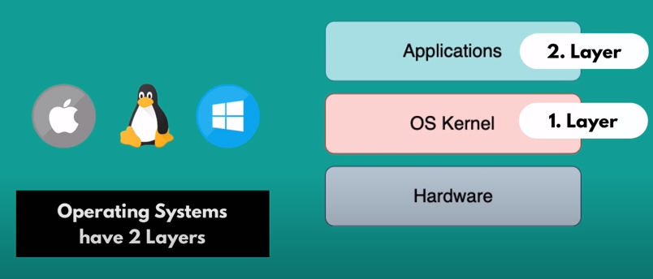
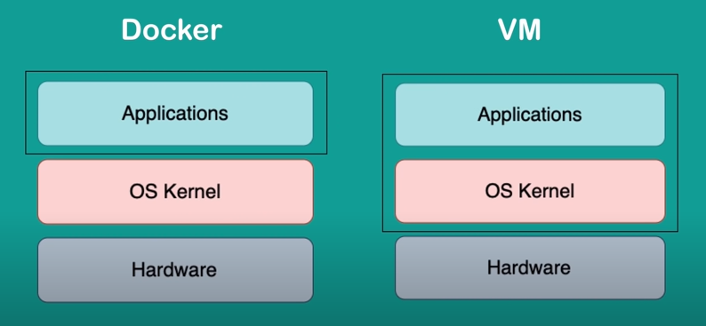
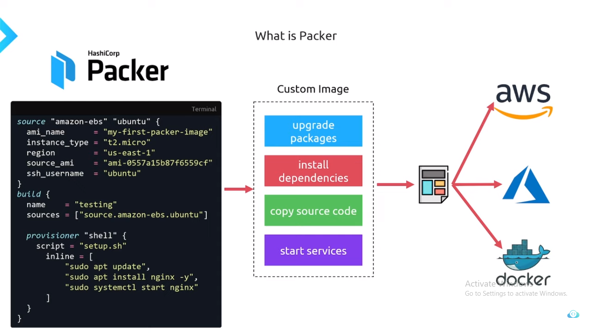
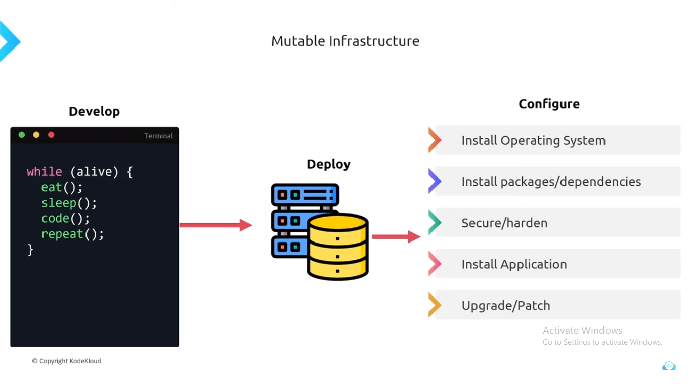
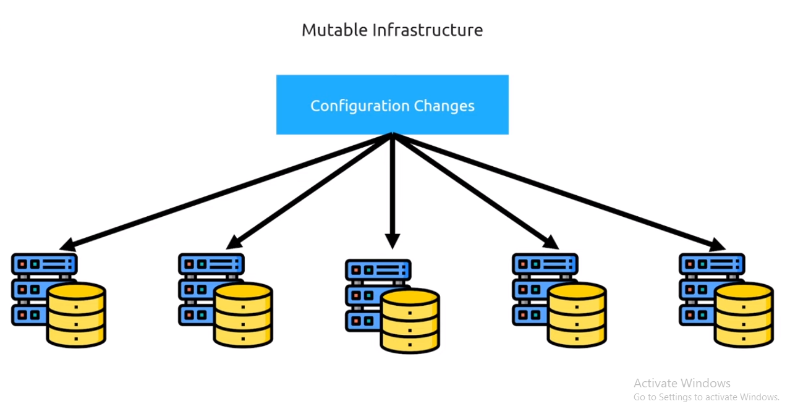
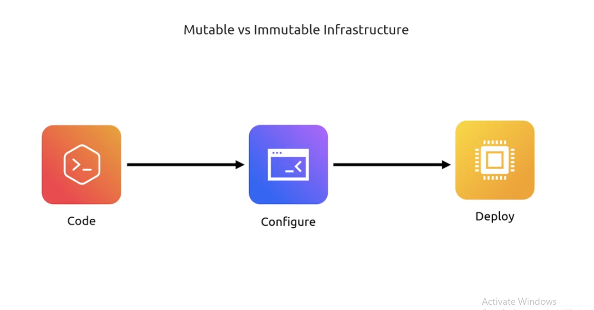
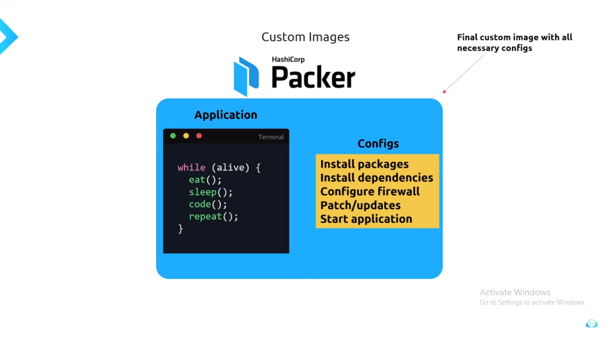

# DevOps Tools

<br>
<p align="center"></p>

## Docker

### What is Docker?

Docker is a software development tool and a virtualization technology that makes it easy to develop, deploy, and manage applications by using containers. A container refers to a lightweight, stand-alone, executable package of a piece of software that contains all the libraries, configuration files, dependencies, and other necessary parts to operate the application.

#### Docker VS Virtual Machine

* Architecture of Operating System



#### Usage of Docker over Virtual Machine

* docker use system's OS kernel
* where as Virtual MAchine creates its own OS Kernel in users system (it allocate CPU,RAM more compare to docker)




#### Advantages of using Docker over VMs

* Lightweight
* Faster boot up time
* Resource efficient
* Security

### What is Container

1. Container is a way of packing application along with some dependencies, specific version and necessary configuration.  
2. This can be portable i.e (easily share and move).  
3. So where this containers stored??  
    This can be upload/stored in Repositories (Docker Hub, Global Quay)

### How application runs Before using docker Containers


1. Installation process different (for window-.exe, ubuntu-.zip/tar file)
2. Due to Different OS (file wont execute)

### After Containers


1. Own Isolated Environment
2. Can install necessary packages and dependencies
3. Run the application without worrying about the underlying infrastructure.
4. Lightweight as compared to Virtual Machines.
5. Faster than VMs because of sharing resources with other containers.
6. Security - No need for installing software on server, just pull from repository.
7. Resource Efficient - Only what you need.
8. Portability - You can run it anywhere.

### Docker Command

Docker image command

```bash
docker build  ## It will build Docker images by using the Dockerfile.  
docker pull  ## Docker pull command will pull the Docker image which is available in the docker-hub.  
docker images  ## It will list all the images which are pulled and build in the docker host.  
docker inspect  ## It will helps to debug the docker image if any errors occurred while building an image or pulling the image.  
docker push  ## Docker command will push the docker image into the Docker hub.  
docker save  ## It will save the docker image in the form of dockerfile.  
docker rmi  ## It will remove the docker image.  
```

Docker Container Command

```bash
docker attach  ## Connecting to an Existing Container
docker ps  ## To list the running containers.  
docker container inspect infinite  ## To Inspect the Docker containers.  
docker exec  ## To execute the commands in the running containers.  
docker cp  ## To copy the file from docker host to the docker containers
```

### CMD VS ENTRYPOINT

CMD

Specifies the default command to run when the container starts.

Can be overridden at runtime by passing arguments to docker run.

Often used for providing defaults (like parameters to ENTRYPOINT).

Example:

```Dockerfile
FROM ubuntu:20.04
CMD ["echo", "Hello from CMD!"]
```

Run:

```bash
docker build -t cmd-example .
docker run cmd-example
```

👉 Output: Hello from CMD!

Now override it:

```bash
docker run cmd-example echo "Overridden!"
```

👉 Output: Overridden!

So CMD is flexible — it’s like a default that the user can change.

🔹 ENTRYPOINT

Defines the main command that will always run.

Arguments passed to docker run are appended to ENTRYPOINT (not overriding it, unless you use --entrypoint).

Best for containers that behave like executables.

Example:

```Dockerfile
FROM ubuntu:20.04
ENTRYPOINT ["echo", "Hello from ENTRYPOINT!"]
```

Run:

```bash
docker build -t entry-example .
docker run entry-example
```

👉 Output: Hello from ENTRYPOINT!

Now pass extra args:

```bash
docker run entry-example world
```

👉 Output: Hello from ENTRYPOINT! world

### Docker Multi-Stage Build

A multi-stage build in Docker allows you to use multiple FROM statements in your Dockerfile, each creating a separate stage of the build process. This approach is particularly useful for creating smaller, more efficient Docker images, as it allows you to copy only the necessary artifacts from one stage to another, leaving behind any intermediate or unnecessary files.

Why Use Multi-Stage Builds?

1. Smaller Images: By copying only the necessary files to the final image, you can significantly reduce the size of your Docker image.  
2. Better Security: You can avoid including build tools and dependencies in the final image, reducing the attack surface.
3. Cleaner Build Process: Each stage can focus on a specific part of the build process, making the Dockerfile easier to understand and maintain.

#### Example: Building a Go Application Using Multi-Stage Build

Step 1: Create a Simple Go Application

```go
// main.go
package main

import "fmt"

func main() {
    fmt.Println("Hello, Docker Multi-Stage Build!")
}
```

Step 2: Create the Dockerfile that uses a multi-stage build.

```Dockerfile
# Stage 1: Build the Go application
FROM golang:1.20 AS build

# Set the working directory inside the container
WORKDIR /app

# Copy the Go source code into the container
COPY . .

# Build the Go application
RUN go mod init example.com/multistage && go build -o app

# Stage 2: Create a minimal image
FROM alpine:latest

# Set the working directory inside the container
WORKDIR /app

# Copies the compiled binary from the first stage (build) to the second stage's /app directory.
COPY --from=build /app/app . 

# Run the application
CMD ["./app"]
```

### Docker workflow


## Packer

### What is Packer?

Packer is a tools which help to create customize Image from multiple platform from a single source configuration.



### Stages of Packer


### Usage of Packer

* Well there are to stages of create Images > Mutable and Immutable
* Mutable means changing Continuously.
* Immutable means needs to configure only one time.
* Mutable is old way to configure the Images.
* Where it needs to configure after deploying the application
* If any case, we want to deploy to multiple server, configure multiple server individually may create new bugs.
* Where as Packer use Immutable, which is configure deploy deploying to server.
* Using single configure Image we can spin up multiple server.

#### Mutable

```DEPLOY > SERVER > CONFIGURE```



Configuring after spinning up server, If any case we need to install dependency into that server
we need to install it each individual server, which can lead to issues and Bugs.



#### Immutable

```DEPLOY > CONFIGURE > SERVER```



In Immutable Deploying and Configuration is done before hosting to server



In Immutable using One Packer we can spin up multiple server


## ArgoCD

### What is ArgoCD?

ArgoCD is a declarative, GitOps continuous delivery tool for Kubernetes. It automates the deployment of the desired application states from Git repositories directly to Kubernetes clusters. Argo CD monitors these repositories for changes, ensuring that the deployed application states match the declared states in the repository.

Key Features:

1. Declarative GitOps: Manages your Kubernetes resources declaratively through Git.

2. Automated Sync: Continuously syncs Kubernetes resources to the desired state defined in Git.

3. Visibility: Provides a web UI and CLI for monitoring and managing application deployments.

4. Rollback and Roll Forward: Easy rollbacks and roll forwards to any git commit.

5. Multi-Cluster Management: Can manage applications across multiple clusters.

### Challenges without ArgoCD

Without Argo CD or a similar GitOps tool, managing Kubernetes deployments can present several challenges:

1. Manual Deployment Processes - Error-Prone: Manual deployment steps can introduce human errors. Inconsistent: Different team members might follow slightly different procedures, leading to inconsistencies. Time-Consuming: Manual deployments take more time and can slow down the development cycle.

2. Lack of Single Source of Truth - Configuration Drift: Without a single source of truth, it’s easy for the actual state of the cluster to drift from the desired state.
Difficult Rollbacks: Rolling back to a previous state can be challenging without a clear history of changes.

3. Limited Visibility and Auditing - Poor Traceability: Tracking who made changes, what changes were made, and why can be difficult.
Compliance Issues: Limited visibility can lead to difficulties in ensuring compliance with regulatory requirements.

4. Inconsistent Environments - Environment Parity: Ensuring that different environments (development, staging, production) are consistent can be challenging without automated synchronization.Complex Management: Managing multiple environments manually can become complex and error-prone.

5. Inefficient Resource Management - Resource Wastage: Manual processes can lead to inefficient use of resources, as it’s harder to optimize and automate resource provisioning and scaling.

6. Scalability Issues - Difficulty Scaling: As the number of services and clusters grows, manually managing deployments becomes increasingly difficult and less scalable.
Coordination Overhead: Coordinating deployments across multiple teams and environments can lead to significant overhead.

7. Operational Overheads - Increased Workload: DevOps teams may spend a significant amount of time on repetitive deployment tasks.
Focus Diversion: Teams might be diverted from more strategic tasks to handle operational issues.

8. Slow Incident Recovery - Delayed Response: Manually identifying and resolving issues can delay incident recovery. Lack of Automation: Without automated rollback and recovery processes, downtime can be longer.

Summary
Implementing a tool like Argo CD helps mitigate these challenges by providing automated, consistent, and reliable deployment processes, ensuring a single source of truth, improving visibility and auditing, and enabling efficient resource management and scalability. This leads to faster, safer, and more efficient software delivery.

### Benefits

Benefits of using ArgoCD

1. **Automated Deployments**

    Continuous Deployment: Argo CD automates the deployment process, ensuring that changes in the Git repository are automatically applied to the Kubernetes cluster.  
    Synchronization: Keeps your applications in sync with the desired state defined in Git, reducing the chances of configuration drift.

2. **Declarative Configuration**

    Single Source of Truth: The desired state of applications is stored in Git, providing a clear and auditable source of truth.  
    Version Control: Every change to the configuration is versioned, enabling easy rollbacks and clear change history.

3. **Improved Security**

    Pull-Based Mechanism: Clusters pull configuration changes, reducing the need for direct access to the cluster and thus improving security.  
    Access Control: Permissions can be managed via Git repository access controls, reducing the need for direct cluster access permissions.

4. **Enhanced Visibility and Monitoring**

    User Interface: Argo CD provides a web UI and CLI for visualizing the state of applications and monitoring deployment status.  
    Notifications and Alerts: Integration with various notification systems to alert users about the state of deployments.

5. **Scalability**

    Multi-Cluster Management: Manage multiple Kubernetes clusters from a single Argo CD instance.  
    Scalable Operations: Easily scale deployments across many clusters and environments.

6. **Operational Efficiency**

    Reduced Manual Effort: Automates repetitive deployment tasks, freeing up developers and DevOps teams to focus on more strategic work.  
    Consistent Environments: Ensures that all environments (development, staging, production) are consistent with each other.

7. **Improved Reliability and Resilience**

    Self-Healing: Automatically detects and corrects drift from the desired state, enhancing the reliability of deployments.  
    Easy Rollbacks: Simplified rollback to previous application states in case of issues, improving resilience.

8. **Compliance and Auditability**

    Audit Trails: Every change is tracked and logged, providing a complete audit trail of who made changes and why.  
    Compliance: Helps in meeting compliance requirements by ensuring configurations are consistent and traceable.

9. **Flexibility and Extensibility**

    Custom Plugins: Supports custom resource definitions and can be extended with custom plugins for specific use cases.  
    Integration: Integrates with other CI/CD tools and workflows, enhancing the overall DevOps pipeline.

10. **Community and Ecosystem**

    Active Community: Argo CD is part of the CNCF and has an active open-source community, ensuring ongoing improvements and support.  
    Ecosystem: Works well with other tools in the Kubernetes ecosystem, such as Helm, Kustomize, and more.

### Components

Component of ArgoCD


1. **API Server**

    Function: Serves as the central control plane for Argo CD.  
    Usage:  
    Exposes the Argo CD API, which can be accessed via CLI, Web UI, or other tools.
    Handles all CRUD operations for Argo CD resources such as Applications, Projects, and Repositories.
    Manages authentication and authorization.

2. **Repository Server**

    Function: Manages interactions with Git repositories.  
    Usage:  
    Fetches and caches Git repository contents.
    Serves Git repository information to other Argo CD components, ensuring they have the necessary data to deploy applications.

3. **Controller**

    Function: Watches the state of applications and ensures they are in sync with the desired state defined in Git.  
    Usage:  
    Continuously monitors the state of applications in the Kubernetes cluster.
    Compares the current state of applications with the desired state from Git.
    Executes synchronization operations to reconcile any differences.

4. **Application Controller**

    Function: Manages the lifecycle of Argo CD applications.  
    Usage:  
    Tracks application resources and manages their state.
    Handles application creation, updates, and deletion.
    Manages synchronization and health status reporting.

5. **Dex**

    Function: Provides OpenID Connect (OIDC) authentication.  
    Usage:
    Integrates with external identity providers like GitHub, Google, LDAP, etc.
    Manages user authentication and provides SSO capabilities.

6. **Redis**

    Function: Acts as an in-memory data store.  
    Usage:
    Enhances performance by caching application state and other data.
    Optional but recommended for large-scale deployments.

7. **Web UI**

    Function: Provides a graphical interface for interacting with Argo CD.  
    Usage:  
    Visualizes the state of applications and their synchronization status.
    Allows users to manage applications, view logs, and perform manual synchronization.
    Provides a user-friendly way to interact with Argo CD without needing to use the CLI.

8. **CLI**

    Function: Command-line interface for interacting with Argo CD.
    Usage:  
    Enables users to perform all Argo CD operations via the terminal.
    Useful for scripting and automation of deployment tasks.
    Offers commands to manage applications, projects, and repositories.

## Ansible

### [Ansible role folder structure](https://docs.ansible.com/ansible/latest/playbook_guide/playbooks_reuse_roles.html)

## [Service Mesh](service_mesh.md)
