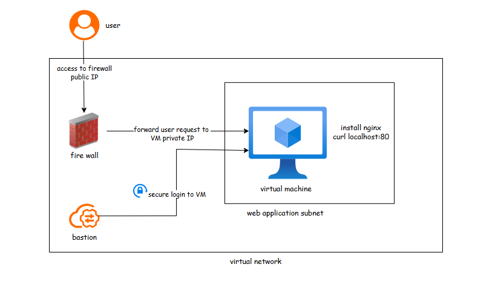

# DevOps Project

## Jenkins-Sonarqube

**Jenkins**: Jenkins is an open-source automation server that helps automate the building, testing, and deploying of software. It's a Java-based platform with plugins for continuous integration.  

**Sonarqube**: SonarQube is a platform for analyzing software for bugs, vulnerabilities, and code smells. It provides reports on duplicated code, coding standards, unit tests, code coverage, code complexity, comments, bugs, and security recommendations.  
In this project you will be guided how to host Jenkins and Sonarqube using docker, also how to automate CI/Cd pipeline and check code analysis.

* here you can find [**README.md**](https://github.com/botlaram/devops_projects/blob/jenkins-sonarqube/README.md)

* [**Repo_link**](https://github.com/botlaram/devops_projects/blob/jenkins-sonarqube/)

## Build Docker using Git Actions

**Git Actions**: GitHub Actions is a continuous integration and continuous delivery (CI/CD) platform that allows you to automate your build, test, and deployment pipeline.
This project is quick most simple and easy to implement on how to build a Docker container using GitHub Actions.  
We will use Python Image and create a Flask web server that serves an `index.html` file. GitHub Actions will be used to automate the container building process, ensuring that the container is built consistently for every new commit into branch.

* here you can find [**README.md**](https://github.com/botlaram/devops_projects/blob/docker-img-gitaction/README.md)

* [**Repo_link**](https://github.com/botlaram/devops_projects/blob/docker-img-gitaction/)

## Host Web Application in azure enabling firewall

1. Create resource grp

2. Create v-net > enable bastion (create new public IP)

3. Enable azure firewall > create new policy

4. Select CIDR range to create subnets

5. Create virtual-machine > create new key-pair > select inbound port (SSH)

6. Network interface > choose subnet as default > select NIC when VM deleted

7. In VM > bastion > add user name and choose.pem file from local

8. Run `apt-get update` > `cd var/www/html` > `vim index.html` > `<h1> hello <h1>` > `curl localhost:80`

9. Restart nginx > `systemctl restart nginx`

10. Firewall > firewall policy > DNAT (destination network address translation rules > add rule collection

11. Add rule > source ip address (user IP-address) > destination > public ip of firewall > translated IP (private ip address of VM) > port (80)
