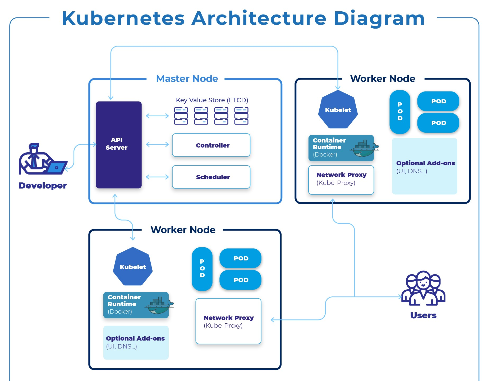
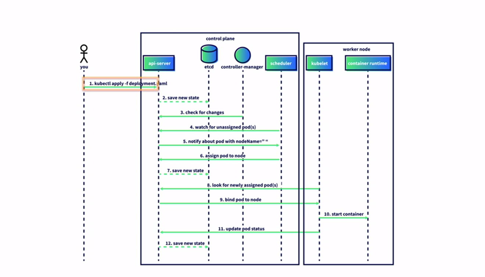
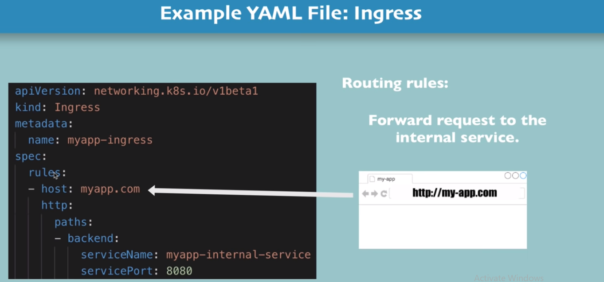
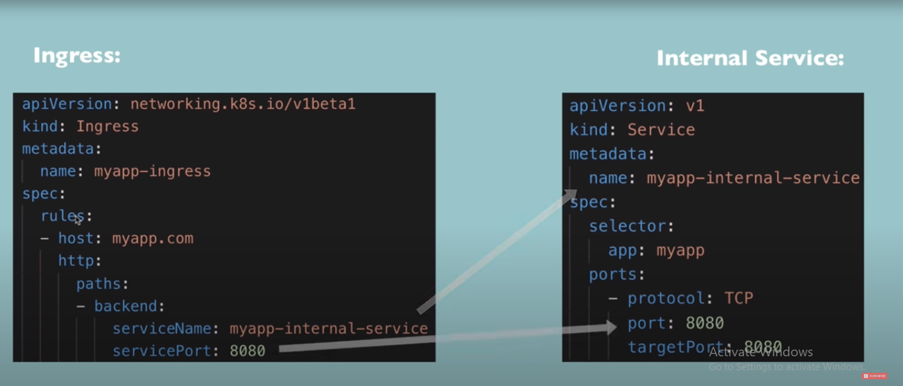
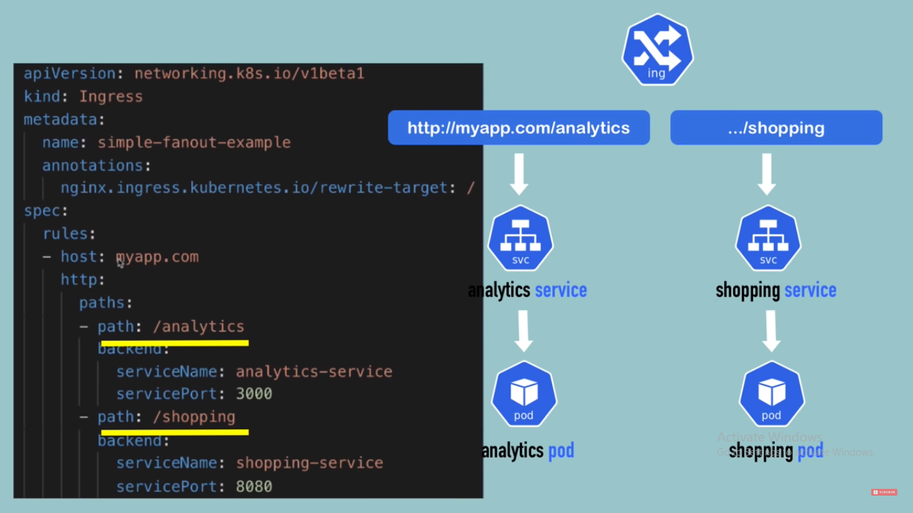
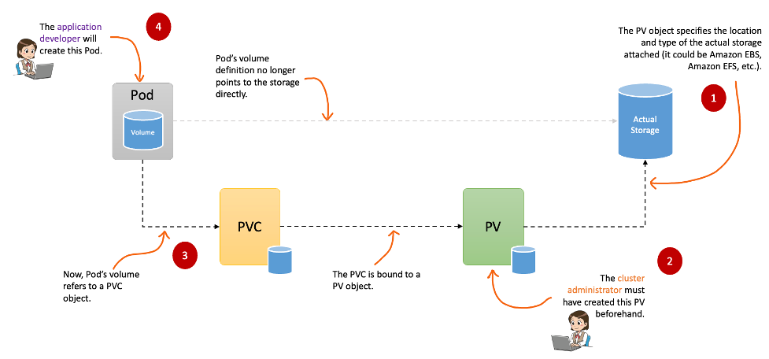
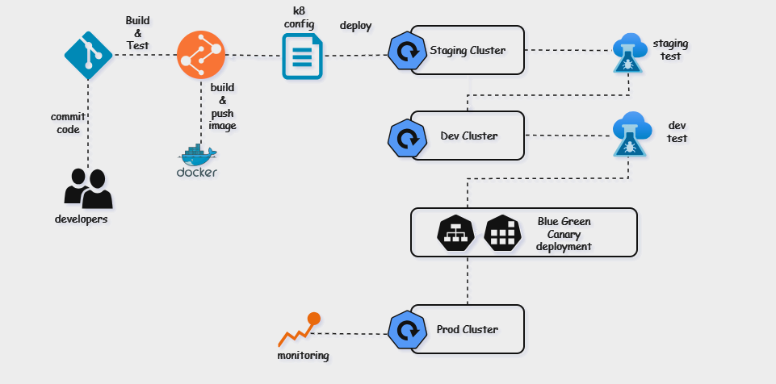

# Kubernetes ☸️

All about k8.

## Definition

Kubernetes is a portable, extensible, open source platform for managing containerized workloads and services, that facilitates both declarative configuration and automation. It has a large, rapidly growing ecosystem. Kubernetes services, support, and tools are widely available.

For more information visit **[here](https://kubernetes.io/docs/concepts/overview/components/)**

## Why to use K8

Containers are a good way to bundle and run your applications. In a production environment, you need to manage the containers that run the applications and ensure that there is no downtime. For example, if a container goes down, another container needs to start. Wouldn't it be easier if this behavior was handled by a system?

That's how Kubernetes comes to the rescue! Kubernetes provides you with a framework to run distributed systems resiliently. It takes care of scaling and failover for your application, provides deployment patterns, and more. For example: Kubernetes can easily manage a canary deployment for your system.

Kubernetes provides you with:

- **Service discovery and load balancing** Kubernetes can expose a container using the DNS name or
  using their own IP address. If traffic to a container is high, Kubernetes is able to load balance and distribute the network traffic so that the deployment is stable.
- **Storage orchestration** Kubernetes allows you to automatically mount a storage system of your 
  choice, such as local storages, public cloud providers, and more.
- **Automated roll outs and rollbacks** You can describe the desired state for your deployed
  containers using Kubernetes, and it can change the actual state to the desired state at a controlled rate. For example, you can automate Kubernetes to create new containers for your deployment, remove existing containers and adopt all their resources to the new container.
  
  Automatic bin packing You provide Kubernetes with a cluster of nodes that it can use to run containerized tasks. You tell Kubernetes how much CPU and memory (RAM) each container needs. Kubernetes can fit containers onto your nodes to make the best use of your resources.

- **Self-healing** Kubernetes restarts containers that fail, replaces containers, kills containers
  that don't respond to your user-defined health check, and doesn't advertise them to clients until they are ready to serve.

- **Secret and configuration management** Kubernetes lets you store and manage sensitive
  information, such as passwords, OAuth tokens, and SSH keys. You can deploy and update secrets and application configuration without rebuilding your container images, and without exposing secrets in your stack configuration.

## Architecture

### Architecture Diagram



### K8 workflow diagram



## Components

### Master Components

The master components form the control plane of the Kubernetes cluster, responsible for managing the cluster's overall operations, making high-level decisions (e.g., scheduling), and monitoring/responding to cluster events.

1. API Server (kube-apiserver)

    Serves as the front-end interface for the Kubernetes control plane.
    Exposes the Kubernetes API, enabling interaction between all components within the cluster.  
    Validates and processes API objects such as pods, services, and replication controllers, ensuring proper configuration and functionality.

2. Etcd

    A distributed key-value store that serves as Kubernetes primary datastore for cluster information.
    Stores critical data, including configuration details, cluster state, and metadata, accessible by all cluster components.
    Guarantees strong consistency and durability, making it a vital component for reliable cluster operations.

3. Controller Manager (kube-controller-manager)

    Manages the cluster’s state by running various controller processes.

    Examples include:

      - Node Controller: Handles situations where nodes become unavailable.
      - Replication Controller: Ensures the desired number of pod replicas.
      - Endpoint Controller: Manages endpoint objects for services.

    Combines multiple logically independent controllers into a single process, reducing operational complexity.

4. Scheduler (kube-scheduler)

    Allocates newly created pods to suitable nodes based on resource availability, affinity/anti-affinity rules, and other constraints.  
    Continuously monitors for unscheduled pods and assigns them to appropriate nodes to maintain cluster efficiency and balance.

### Node Components

Node components run on every node in the cluster and manage the containers running on those nodes.

1. kubelet

    An agent that runs on each node in the cluster.  
    Ensures that the containers described by pod specs are running and healthy.  
    Communicates with the Kubernetes API server and reports the status of the node and the pods running on it.

2. kube-proxy

    A network proxy that runs on each node.  
    Manages the network rules on nodes, allowing network communication to your pods from inside or outside the cluster.  
    Handles the forwarding of requests to the appropriate pod and ensures that services are accessible.

3. Container Runtime

    The software responsible for running the containers (e.g., Docker, containerd, CRI-O).  
    Kubernetes supports multiple container runtimes, and the kubelet uses the Container Runtime Interface (CRI) to communicate with them.  

### Additional Components

1. Pod

    The smallest and simplest Kubernetes object, representing a single instance of a running process in the cluster.  
    Typically contains one or more containers that share the same network namespace and storage.

2. Service

    A Service is an abstraction that defines a logical set of pods and enables network access to them. It provides a stable endpoint (IP and DNS) to access a group of pods, regardless of the underlying changes to the pod instances (e.g., pods scaling up or down)  

3. ConfigMaps and Secrets:

    ConfigMaps: Used to store non-confidential data in key-value pairs. Pods can consume ConfigMaps as environment variables, command-line arguments, or configuration files.  

    Secrets: Similar to ConfigMaps but specifically designed to store sensitive data like passwords, tokens, and keys.  

4. Namespaces:

    Virtual clusters backed by the same physical cluster.  
    Useful for dividing cluster resources between multiple users, teams, or projects.

5. Persistent Volumes (PVs) and Persistent Volume Claims (PVCs):

    PV: Storage resources in the cluster, such as an external disk, network storage, etc.  
    PVC: Requests for storage by a user, which are then matched to available PVs.

6. Ingress

    An Ingress is a more advanced resource that manages external HTTP(S) traffic into the cluster. It provides rules to control how external clients access services within the cluster.

    Key Features:

    - Path-Based Routing: Routes incoming traffic based on the URL path (e.g., /api or /static).
    - Host-Based Routing: Routes traffic based on the host name `(e.g., api.example.com vs www.example.com)`.
    - TLS Support: Manages HTTPS traffic with SSL/TLS certificates.
    - Custom Rules: Supports more advanced traffic management compared to a Service

### Deployment

- [deployment](https://kubernetes.io/docs/concepts/workloads/controllers/deployment/)

### Node

- [nodes](https://kubernetes.io/docs/concepts/architecture/nodes/)

### Pod

- [pods](https://kubernetes.io/docs/concepts/workloads/pods/)

### [Service](https://kubernetes.io/docs/concepts/services-networking/service/)

#### Cluster IP

- ClusterIP is the default and most common service type.
- Kubernetes will assign a cluster-internal IP address to ClusterIP service. This makes the service only reachable within the cluster.
- You cannot make requests to service (pods) from outside the cluster.
- You can optionally set cluster IP in the service definition file.

**Use Cases**: Inter service communication within the cluster. For example, communication between the front-end and back-end components of your app.

```yaml
apiVersion: v1
kind: Service
metadata:
  name: my-backend-service
spec:
  type: ClusterIP # Optional field (default)
  clusterIP: 10.10.0.1 # within service cluster ip range
  ports:
  - name: http
    protocol: TCP
    port: 80
    targetPort: 8080
```

#### NodePort

- NodePort service is an extension of ClusterIP service. A ClusterIP Service, to which the NodePort Service routes, is automatically created.
- It exposes the service outside of the cluster by adding a cluster-wide port on top of ClusterIP.
- NodePort exposes the service on each Node’s IP at a static port (the NodePort). Each node proxies that port into your Service. So, external traffic has access to fixed port on each Node. It means any request to your cluster on that port gets forwarded to the service.
- You can contact the NodePort Service, from outside the cluster, by requesting `<NodeIP>:<NodePort>`.
- Node port must be in the range of 30000–32767. Manually allocating a port to the service is optional. If it is undefined, Kubernetes will automatically assign one.
- If you are going to choose node port explicitly, ensure that the port was not already  used by another service.

**Use Cases** : When you want to enable external connectivity to your service. Using a NodePort gives you the freedom to set up your own load balancing solution, to configure environments that are not fully supported by Kubernetes, or even to expose one or more nodes’ IPs directly. Prefer to place a load balancer above your nodes to avoid node failure.

```yaml
apiVersion: v1
kind: Service
metadata:
  name: my-frontend-service
spec:
  type: NodePort
  selector:
    app: web
  ports:
  - name: http
    protocol: TCP
    port: 80
    targetPort: 8080
    nodePort: 30000 # 30000-32767, Optional field
```

#### LoadBalancer

- LoadBalancer service is an extension of NodePort service. NodePort and ClusterIP Services, to which the external load balancer routes, are automatically created.
- It integrates NodePort with cloud-based load balancers.
- It exposes the Service externally using a cloud provider’s load balancer.
- Each cloud provider (AWS, Azure, GCP, etc) has its own native load balancer implementation.
- The cloud provider will create a load balancer, which then automatically routes requests to your Kubernetes Service.
- Traffic from the external load balancer is directed at the backend Pods. The cloud  provider decides how it is load balanced.
- The actual creation of the load balancer happens asynchronously.
- Every time you want to expose a service to the outside world, you have to create a new LoadBalancer and get an IP address.

**Use Cases**: When you are using a cloud provider to host your Kubernetes cluster.

```yaml
apiVersion: v1
kind: Service
metadata:
  name: my-frontend-service
spec:
  type: LoadBalancer
  clusterIP: 10.0.171.123
  loadBalancerIP: 123.123.123.123
  selector:
    app: web
  ports:
  - name: http
    protocol: TCP
    port: 80
    targetPort: 8080
```

#### ExternalName

- Services of type ExternalName map a Service to a DNS name, not to a typical selector such as my-service.
- You specify these Services with the `spec.externalName` parameter.
- It maps the Service to the contents of the externalName field (e.g. foo.bar.example.com), by returning a CNAME record with its value.
- No proxy of any kind is established.

**Use Cases**: This is commonly used to create a service within Kubernetes to represent an external datastore like a database that runs externally to Kubernetes. You can use that ExternalName service (as a local service) when Pods from one namespace to talk to a service in another namespace.

```yaml
apiVersion: v1
kind: Service
metadata:
  name: my-service
spec:
  type: ExternalName
  externalName: my.database.example.com
```

### Ingress

- [ingress](https://kubernetes.io/docs/concepts/services-networking/ingress/)

#### Architecture of Ingress


#### Ingress YAML



#### Ingress Vs Internal Service



#### Ingress YAML for path



### Volumes

#### Architecture of Persistent Volume



#### Backup Volumes

- [Volumes](https://kubernetes.io/docs/concepts/storage/volumes/)

- We also use **Git Repo** as Persistent Volume - [link](https://kubernetes.io/docs/concepts/storage/volumes/#gitrepo)

#### StorageClass

Follow the docs for further info of [StorageClass](https://kubernetes.io/docs/concepts/storage/storage-classes/)

Template for storage class

```yaml
apiVersion: storage.k8s.io/v1
kind: StorageClass
metadata:
  name: azurefile-sc
provisioner: kubernetes.io/azure-file
reclaimPolicy: Retain
mountOptions:
  - dir_mode=0777
  - file_mode=0777
volumeBindingMode: WaitForFirstConsumer
```

Key definition:
  
- **volumeBindingMode**:
  This field specifies when volume binding should occur. In this case, Immediate means that a volume should be provisioned and bound as soon as a PersistentVolumeClaim (PVC) is created. This is in contrast to WaitForFirstConsumer, where the binding is delayed until a pod using the PVC is scheduled onto a node.

- **reclaimPolicy** : in Persistent Volumes specifies what should happen to the underlying storage when the associated PersistentVolume (PV) is released or the PersistentVolumeClaim (PVC) is deleted:

- **Retain**: When the reclaimPolicy is set to Retain, the PV is not automatically deleted when the associated PVC is deleted.
The PV is marked as released, and it's up to the cluster administrator to decide what to do with the data on the storage.

- **Delete**: When the reclaimPolicy is set to Delete, the PV is automatically deleted when the associated PVC is deleted.
The storage resources associated with the PV are also deleted.

#### PV and PVC

**PersistentVolume (PV)**: A piece of storage in the cluster that has been provisioned by an administrator or dynamically through Storage Classes. PVs are used to store data persistently.

**PersistentVolumeClaim (PVC)**: A request for storage by a user. PVCs abstract the details of how storage is provided and consumed, making it easy to request and use persistent storage in pods.

### [RBAC](https://kubernetes.io/docs/reference/access-authn-authz/rbac/)

service account: user groups  
role: define permissions to user  
role binding: connect role with service account  

### Daemonset

A DaemonSet in Kubernetes ensures that a specific Pod runs on all (or selected) nodes in a cluster. It is primarily used for running background processes or system-level tasks that are required on every node.

By understanding and leveraging DaemonSets, administrators can efficiently handle logging, monitoring, networking, and other system-wide tasks.

Key Features of DaemonSet

- Node-Wide Coverage: Ensures a Pod is scheduled on every eligible node in the cluster.
- Automatic Updates: When a new node is added to the cluster, the DaemonSet automatically schedules its Pods on the new node.
- Selective Node Targeting: By using node selectors, taints, and tolerations, DaemonSets can restrict Pods to specific nodes.
- Resiliency: If a node is deleted or fails, the DaemonSet recreates the Pod on a healthy node.

Use Cases of DaemonSet

1. Log Collection: Running log collection agents (e.g., Fluentd or Logstash) on every node.
2. Monitoring: Deploying monitoring agents (e.g., Prometheus Node Exporter) to collect node-level metrics.
3. Networking: Running network-related applications like CNI plugins or proxy daemons (e.g., Calico or Istio).
4. Storage: Deploying storage daemons for distributed storage solutions (e.g., Ceph, GlusterFS).

How DaemonSet Works : A DaemonSet controller ensures that a single copy of the specified Pod is running on every eligible node:

1. When the DaemonSet is created, the controller schedules a Pod on each matching node.
2. If a new node is added, the controller automatically schedules the Pod on that node.
3. If a node is removed, the associated Pod is deleted.

### HPA and VPA

**Horizontal Pod Autoscaler (HPA)** : The Horizontal Pod Autoscaler (HPA) automatically adjusts the number of Pods in a Deployment, ReplicaSet, or StatefulSet based on observed CPU, memory usage, or custom metrics. It ensures that the application can handle workload variations without over-provisioning or under-provisioning.

How It Works

- HPA monitors the target resource's metrics (e.g., CPU utilization).
- Based on the observed metrics and the scaling configuration, HPA increases or decreases the number of Pods in the resource.

Use Case - HPA is ideal for scaling stateless applications or services that need to handle fluctuating workloads, such as web servers or APIs.

Key Features

- Scales Pods horizontally by increasing or decreasing their count.
- Supports both resource metrics (CPU/memory) and custom/external metrics.

Example YAML

```yaml
apiVersion: autoscaling/v2
kind: HorizontalPodAutoscaler
metadata:
  name: nginx-hpa
spec:
  scaleTargetRef: # Specifies the target resource (Deployment, ReplicaSet, or StatefulSet).
    apiVersion: apps/v1
    kind: Deployment
    name: nginx-deployment
  minReplicas: 1
  maxReplicas: 10 # Define the minimum and maximum number of Pods.
  metrics: # Sets the metric type and target utilization (e.g., CPU utilization at 50%).
Commands to Deploy HPA
  - type: Resource
    resource:
      name: cpu
      target:
        type: Utilization
        averageUtilization: 50
```

**Vertical Pod Autoscaler (VPA)** : The Vertical Pod Autoscaler (VPA) adjusts the resource requests and limits (CPU and memory) of Pods automatically based on actual usage. It ensures that Pods have sufficient resources to run efficiently without wasting resources.

How It Works

- VPA monitors the resource usage of Pods.
- Based on the observed usage, VPA recommends or directly updates the resource requests and limits for the Pods.
- In update mode, Pods are restarted to apply the new resource requests and limits.

Use Case - VPA is ideal for workloads with predictable scaling patterns or that need fine-tuned resource management, such as batch jobs or databases.

Key Features

- Adjusts resource requests and limits (CPU/memory) for Pods.
- Operates in three modes:  
  Off: Only provides recommendations.  
  Auto: Updates resource requests/limits and restarts Pods.  
  Initial: Sets resource requests/limits only for new Pods.

Example YAML

```yaml
apiVersion: autoscaling.k8s.io/v1
kind: VerticalPodAutoscaler
metadata:
  name: nginx-vpa
spec:
  targetRef: # Specifies the target resource for VPA (e.g., Deployment).
    apiVersion: apps/v1
    kind: Deployment
    name: nginx-deployment
  updatePolicy:
    updateMode: "Auto" # Updates resource requests/limits and restarts Pods.
```

### Stateful vs Stateless in Kubernetes

In Kubernetes, workloads can be classified as either stateful or stateless, depending on how they handle and persist data. Understanding the difference is critical for designing applications that run effectively in a Kubernetes environment.

**Stateless Applications**: Stateless applications do not store any data or state between sessions or transactions. Each request is independent and does not rely on previous interactions.

Characteristics

- No dependency on underlying storage.
- Can be scaled easily as there is no need to synchronize state.
- Requests can be processed by any instance of the application.
- Commonly used for APIs, web servers, and microservices.

Examples

- Web servers (e.g., Nginx, Apache).
- RESTful APIs.
- Batch job workers.

Kubernetes Implementation:

Deploy using Deployments or ReplicaSets.  
Stateless pods can be scaled horizontally using kubectl scale or Horizontal Pod Autoscaler (HPA).  
Use ephemeral storage like /tmp or environment variables for temporary data.

**Stateful Applications**: Stateful applications maintain a state or rely on persisted data across sessions or interactions. This state might be specific to a user, session, or process.

Characteristics:

- Depend on persistent storage (e.g., databases, file systems).
- Require a unique identity for each instance (pod) to preserve state.
- Often need order or consistency in the deployment and scaling process.
- More complex to scale compared to stateless applications.

Examples:

- Databases (e.g., MySQL, PostgreSQL, MongoDB).
- Message queues (e.g., RabbitMQ, Kafka).
- Stateful systems like Elasticsearch.

Kubernetes Implementation:
Deploy using StatefulSets to ensure each pod gets a unique identity (e.g., mypod-0, mypod-1).  
Use PersistentVolume (PV) and PersistentVolumeClaim (PVC) for storage.  
Data is preserved even if pods are deleted or rescheduled.

**Use Cases**.

**Stateless Applications**:

Use cloud-native storage solutions for external state (e.g., S3, RDS).  
Leverage Kubernetes' scalability features for performance optimization.

**Stateful Applications**:

Use StatefulSets to ensure unique pod identities and persistent data.  
Employ proper backup strategies for PersistentVolumes.  
Configure pod anti-affinity to distribute pods across nodes for high availability.

## Deployment Strategy


Kubernetes provides several deployment strategies to manage application updates, ensuring minimal downtime, stability, and user experience during the deployment process.  
Below is a detailed explanation of Canary, Blue-Green, Recreate, and Rolling Update strategies, along with real-world scenarios for when and why they are used.

1. **Canary Deployment**

    **Description:**  
    In a canary deployment, a new version of the application is gradually rolled out to a small subset of users or traffic. If it performs well, the rollout continues until the new version fully replaces the old version.

    **Steps:**

    - Deploy the new version to a small percentage of users (e.g., 5-10% of traffic).  
    - Monitor metrics like performance, error rates, or user feedback.  
    - Gradually increase the traffic directed to the new version until it fully replaces the old one.

    **Use Case:**  
    Scenario: A retail website launching a new search feature. The search functionality is critical, and any errors could impact customer satisfaction.  
    Why Use: Canary deployment ensures that only a small fraction of users experience issues, allowing rollback with minimal impact if the new feature causes errors.

    Pros:  
      - Minimizes risk by exposing new changes to a small subset of users initially.  
      - Real-world testing under production conditions.  
      - Easier to detect issues early in the rollout process.  

    Cons:
      - Requires advanced traffic management tools (e.g., Istio or NGINX for traffic splitting).  
      - Monitoring and rollback processes need to be well-defined.    

2. **Blue-Green Deployment**

    **Description**: Two environments, "Blue" (current version) and "Green" (new version), are maintained simultaneously. Once the new version is verified in the Green environment, traffic is switched from Blue to Green.

    **Steps**:

    - Deploy the new version to the Green environment.  
    - Test the Green environment for functionality, performance, and stability.  
    - Redirect all traffic from the Blue to the Green environment (via a load balancer or DNS change).  
    - The Blue environment serves as a backup in case of rollback.

    **Use Case**:

    Scenario: A banking application rolling out a new version of its transaction processing service. Downtime is unacceptable, and rollback must be quick.  
    Why Use: Blue-Green ensures zero downtime during deployment and allows for an instant rollback by switching back to the Blue environment.

    Pros:
    - Zero downtime during deployment.  
    - Instant rollback by switching traffic back to the old environment.  
    - Both environments are fully isolated, reducing the risk of deployment errors.

    Cons:
    - Requires double the infrastructure (temporary) for both environments.  
    - Higher cost during deployment phases due to resource duplication.  

3. **Recreate Deployment**

    **Description**: The current version of the application is terminated completely, and the new version is deployed in its place. This is a "replace all" strategy.

    **Steps**:
    - Terminate all pods running the old version of the application.  
    - Deploy the new version.

    **Use Case**:
    Scenario: A batch processing job where downtime is acceptable and maintaining multiple versions concurrently is unnecessary.  
    Why Use: Recreate is simple, cost-effective, and appropriate when the application doesn't need to handle live user traffic during deployment.

    Pros:
    - Simple to implement with minimal complexity.  
    - No need to manage traffic splitting or multiple versions.  
    - Suitable for stateless or low-traffic applications.

    Cons:
    - Causes downtime as the old version is terminated before the new version becomes available.  
    - No gradual transition, so any errors immediately impact all users.

4. **Rolling Update Deployment**

    **Description**: A gradual replacement of old pods with new pods, ensuring some pods of the old version remain available while new pods are deployed.

    **Steps**:
    - Deploy the new version pod-by-pod, gradually replacing old pods.
    - Maintain a specified number of pods running at all times during the update.
    - Continue until all old pods are replaced.

    **Use Case**:
    Scenario: A video streaming platform updating its content delivery service. Continuous service is critical, and downtime is unacceptable.  
    Why Use: Rolling updates ensure zero downtime by maintaining the availability of old pods while the new version is rolled out.

    Pros:
    - Zero downtime during deployment.  
    - Gradual replacement reduces the risk of introducing issues.  
    - Supports controlled rollout by limiting the number of simultaneous updates.

    Cons:
    - Rollback is slower compared to Canary or Blue-Green.  
    - Not suitable for breaking changes that require all pods to be updated simultaneously.

**Comparison Table**:

| **Strategy**       | **Downtime**      | **Risk**               | **Rollback Complexity**   | **Resource Requirements** | **Best For**                                  |
|---------------------|-------------------|------------------------|---------------------------|---------------------------|-----------------------------------------------|
| **Canary**          | No               | Low                    | Easy (stop traffic to new pods) | Moderate                   | Gradual rollouts for feature testing.         |
| **Blue-Green**      | No               | Very Low               | Very Easy (switch traffic back) | High (requires two environments) | Critical applications needing zero downtime. |
| **Recreate**        | Yes              | High                   | Moderate                  | Low                       | Simple updates where downtime is acceptable. |
| **Rolling Update**  | No               | Moderate               | Moderate                  | Low                       | Applications requiring zero downtime with gradual updates. |

## k8-pipeline architecture



## Scenario

1. How to fix K8 deployment
  

2. How to manage k8 resource (so that pods should not exceeds resources / should not consume
whole cluster/namespace Quota
  

3. How to upgrade [k8 version](https://devopscube.com/setup-kubernetes-cluster-kubeadm/)

## K8 yaml generator

Link [here](https://k8syaml.com/)
