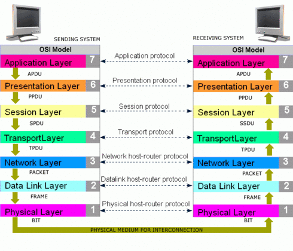
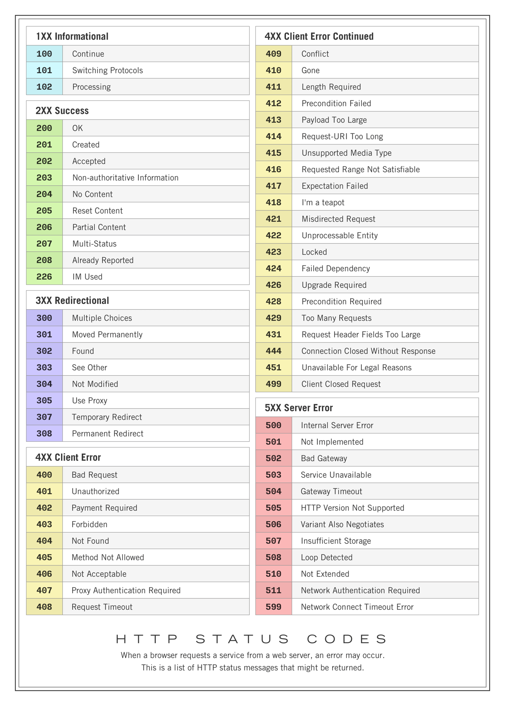

---
hide:
  - tags
---

# Computer Networking

- [Computer Networking](#computer-networking)
  - [Protocol:](#protocol)
    - [TCP (Transmission Control Protocol):](#tcp-transmission-control-protocol)
    - [HTTP (Hypertext Transfer Protocol):](#http-hypertext-transfer-protocol)
    - [UDP (User Datagram Protocol):](#udp-user-datagram-protocol)
  - [Router](#router)
  - [Port Number:](#port-number)
  - [Internet speed](#internet-speed)
  - [OSI Model](#osi-model)
    - [Physical Layer (Layer 1):](#physical-layer-layer-1)
    - [Data Link Layer (Layer 2):](#data-link-layer-layer-2)
    - [Network Layer (Layer 3):](#network-layer-layer-3)
    - [Transport Layer (Layer 4):](#transport-layer-layer-4)
    - [Session Layer (Layer 5):](#session-layer-layer-5)
    - [Presentation Layer (Layer 6):](#presentation-layer-layer-6)
    - [Application Layer (Layer 7):](#application-layer-layer-7)
  - [TCP/IP](#tcpip)
    - [Application Layer:](#application-layer)
    - [Transport Layer:](#transport-layer)
    - [Internet Layer:](#internet-layer)
    - [Link Layer:](#link-layer)
  - [OSI vs TCP/IP](#osi-vs-tcpip)
  - [HTTPS Request](#https-request)
  - [HTTPS Status Code](#https-status-code)
  - [SMTP: (Sender Mail Transfer Protocol)](#smtp-sender-mail-transfer-protocol)
  - [Delete local host running backend using netstat](#delete-local-host-running-backend-using-netstat)


## Protocol:

  Protocol refers to a set of rules and conventions that define how data is transmitted, received, and processed between devices and systems connected to the network. These rules ensure that devices can understand and communicate with each other effectively, enabling the seamless exchange of information across the internet.

### TCP (Transmission Control Protocol):

Imagine sending a letter through the postal service. TCP is like a reliable, organized courier service that guarantees the letter's delivery.
TCP ensures that data is transmitted in a precise, ordered manner, and it makes sure that the data arrives without errors. If a packet of data is lost or damaged during transmission, TCP requests the missing data to be sent again until everything is received correctly.
It is commonly used for applications that require accurate data delivery, like web pages, emails, and file downloads.

### HTTP (Hypertext Transfer Protocol):

HTTP is like a set of rules that web browsers and web servers follow to communicate with each other. It's the language they use to exchange web pages and other resources.
When you type a website address (URL) into your browser and hit Enter, your browser sends an HTTP request to the web server asking for the webpage. The server responds with the requested webpage, and your browser displays it for you to see.
HTTP is the foundation of the World Wide Web, allowing us to access websites and navigate the internet.


### UDP (User Datagram Protocol):

UDP is like a fast, simple, but less reliable delivery service. It's useful for scenarios where speed is more important than guaranteed delivery.
Unlike TCP, UDP doesn't ensure that data arrives in order or without errors. It just sends the data as quickly as possible. If some data packets are lost during transmission, UDP does not request retransmission.
It is commonly used for real-time applications like video streaming, online gaming, and VoIP (Voice over Internet Protocol), where slight delays are acceptable and retransmission might cause more issues than it solves.

## Router


Every Router/Modem has Global IP address, this IP address is shared to each device(computer/mobile) that connected to Router/Modem.
for eg: If you run multiple applications as google, whatsapp and send request to internet, the device configure to send back response to particular Application using Port number.
In simple IP address is to figureout which device/router you are using and Port number is to find from which Application response need to send.


## Port Number:


Well-Known Ports (0-1023): Port numbers from 0 to 1023 are reserved for well-known services. Many of these ports are standardized for specific applications and protocols. For example, port 80 is commonly used for HTTP, port 443 for HTTPS, and port 22 for SSH.

Registered Ports (1024-49151): Port numbers from 1024 to 49151 are assigned to registered services. These ports are used for various applications and services, and some have been officially registered with the Internet Assigned Numbers Authority (IANA).
for eg: SQL = 1433
MongoDB = 27017

Dynamic/Private Ports (49152-65535): Port numbers from 49152 to 65535 are considered dynamic or private ports. They are used for temporary or private purposes, and they are less likely to be officially registered with IANA.

## Internet speed


## OSI Model



The OSI (Open Systems Interconnection) model is a conceptual framework that standardizes the functions of a telecommunication or computing system into seven distinct layers. The model was developed by the International Organization for Standardization (ISO) to promote interoperability and facilitate communication between different systems and devices. Each layer in the OSI model represents a specific set of functions and services, and it helps in understanding and troubleshooting network communication.

The seven layers of the OSI model, from the bottom to the top, are as follows:

### Physical Layer (Layer 1):

The physical layer is responsible for transmitting raw bits over a physical medium, such as cables or wireless signals.
It defines the electrical, mechanical, and procedural aspects of data transmission, such as voltage levels, cable types, and physical connectors.

### Data Link Layer (Layer 2):

The data link layer is responsible for reliable data transfer between directly connected devices on the same network segment.
It provides error detection and correction, and it ensures that data frames are transmitted and received correctly.

### Network Layer (Layer 3):

The network layer is responsible for routing data packets between different networks.
It handles logical addressing, like IP addresses, and determines the best path for data to reach its destination.

### Transport Layer (Layer 4):

The transport layer provides end-to-end communication between devices on different networks.
It ensures reliable data delivery, flow control, and error recovery using protocols like TCP (Transmission Control Protocol) and UDP (User Datagram Protocol).

### Session Layer (Layer 5):

The session layer establishes, maintains, and terminates connections (sessions) between applications on different devices.
It manages dialogues between applications, synchronization, and checkpointing for data exchange.

### Presentation Layer (Layer 6):

The presentation layer is responsible for data representation and encryption/decryption if needed.
It translates data between the application format and the network format, ensuring that both systems can understand each other.

### Application Layer (Layer 7):

The application layer is the topmost layer that directly interacts with user applications and services.
It provides network services to end-users, such as email, file transfer, web browsing, and other network applications.

## TCP/IP

The TCP/IP model, also known as the Internet Protocol Suite, is a conceptual framework used to understand and implement network communication in the context of the internet. It was developed by the United States Department of Defense and is the foundation of the modern internet and many other computer networks. The TCP/IP model consists of four layers, each with specific functionalities:

### Application Layer:

The Application Layer is the topmost layer and directly interacts with user applications and services. It provides network services to end-users and enables applications to communicate with the network.
Protocols at this layer include HTTP (for web browsing), SMTP (for email), FTP (for file transfer), and DNS (for domain name resolution).

### Transport Layer:

The Transport Layer is responsible for end-to-end communication between devices on different networks. It ensures reliable data delivery, flow control, and error recovery.
Two main protocols at this layer are TCP (Transmission Control Protocol) and UDP (User Datagram Protocol). TCP provides reliable and ordered data delivery, while UDP is used for faster but less reliable data transmission.

### Internet Layer:

The Internet Layer is responsible for routing data packets between different networks. It handles logical addressing, such as IP addresses, and determines the best path for data to reach its destination.
The core protocol at this layer is IP (Internet Protocol), which provides the unique addressing scheme necessary for devices to communicate across the internet.

### Link Layer:

The Link Layer, also known as the Network Interface Layer or Data Link Layer, is responsible for reliable data transfer between directly connected devices on the same network segment.
It defines how data frames are transmitted and received over the physical medium, such as Ethernet or Wi-Fi.
Various technologies and protocols, such as Ethernet, Wi-Fi (IEEE 802.11), and PPP (Point-to-Point Protocol), operate at this layer.


## OSI vs TCP/IP


## HTTPS Request


## HTTPS Status Code



## SMTP: (Sender Mail Transfer Protocol)


## Delete local host running backend using netstat

```
netstat -ano | findstr 9090
netstat -a -o | find "9090"
taskkill /F /PID 12345

```