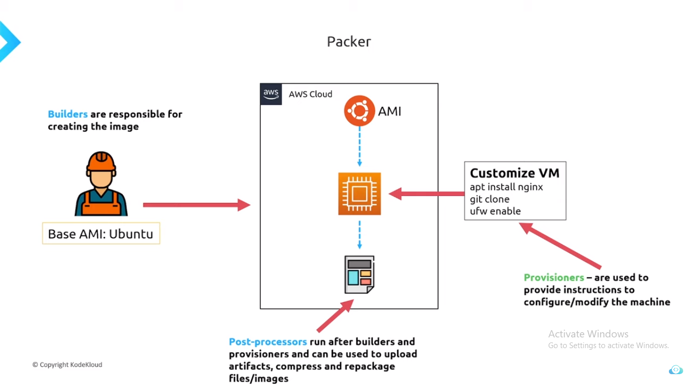

# Packer

- [Packer](#packer)
  - [What is Packer?](#what-is-packer)
  - [Stages of Packer](#stages-of-packer)
  - [Usage of Packer](#usage-of-packer)
    - [Mutable and Immutable stage](#mutable-and-immutable-stage)
      - [Mutable](#mutable)
      - [Immutable](#immutable)

## What is Packer?

Packer is a tools which help to create customize Image from multiple platform from a single source configuration.

## Stages of Packer

## Usage of Packer

### Mutable and Immutable stage

WHY to use PACKER.????

- Well there are to stages of create Images > Mutable and Immutable

- Mutable means changing Continuosly.

- Immutable means needs to configure only one time.

- Mutable is old way to configure the Images.

- Where it needs to cofingure after deploying the application 

- If any case, we want to deploy to multiple server, configure multiplt server individually may create new bugs.

- Where as Packer use Immutable, which is configure deploy deplying to server.

- Using single configure Image we can spin up multiple server.

#### Mutable

**DEPLOY > SERVER > CONFIGURE**

Configuring after spinning up server, If any case we need to install dependency into that server
we need to isntall it each individual server, which can lead to issues and Bugs.

#### Immutable

**DEPLOY > CONFIGURE > SERVER**

In Immutable Deploying and Configuration is done before hosting to server

In Immutable using One Packer we can spin up multiple server

