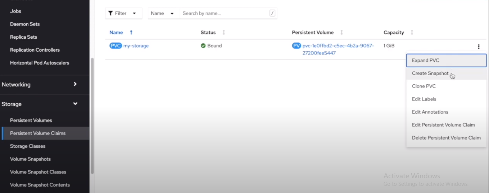
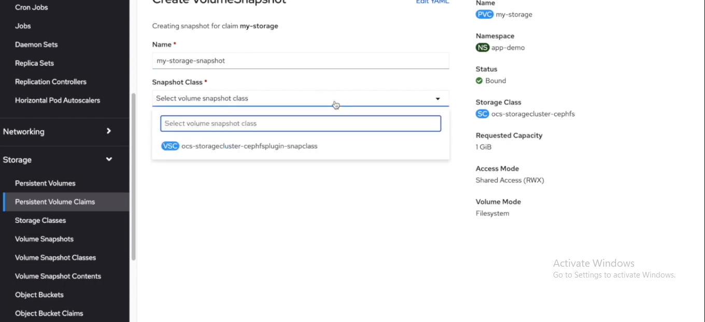
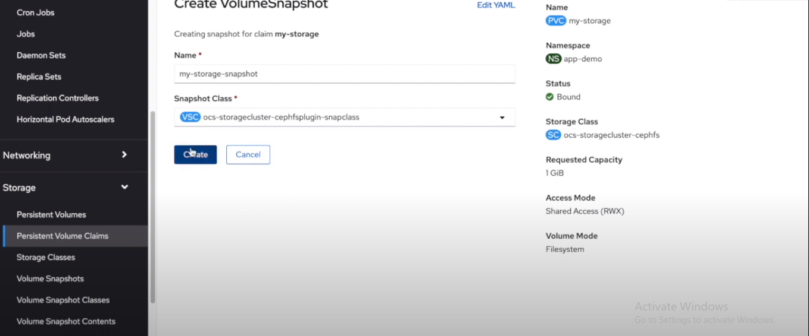
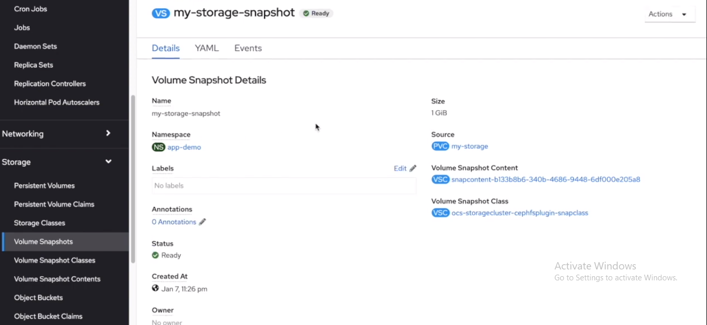
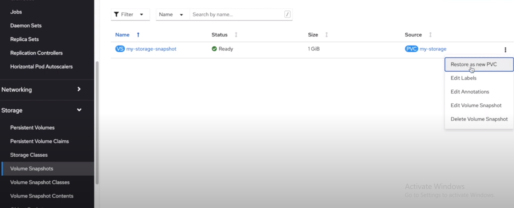
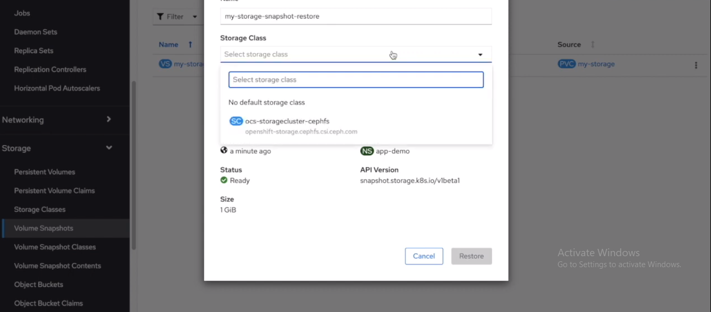
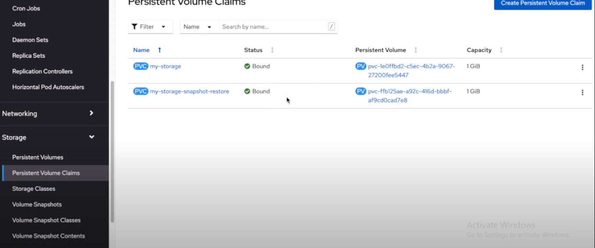
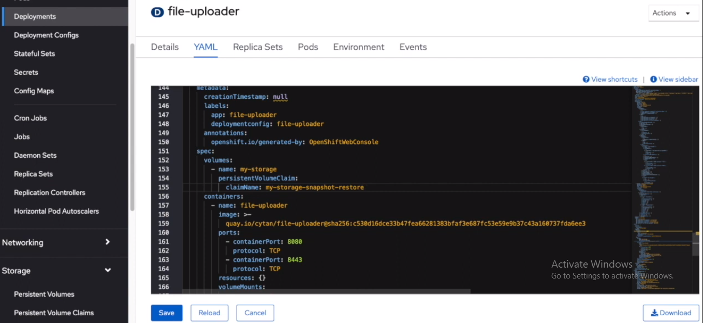
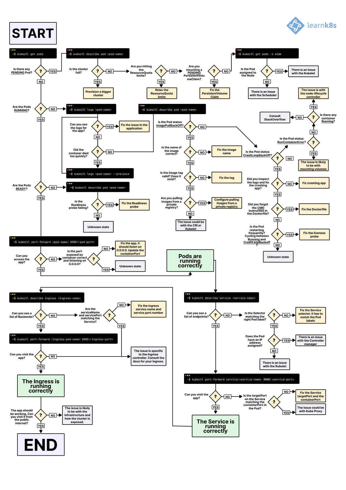
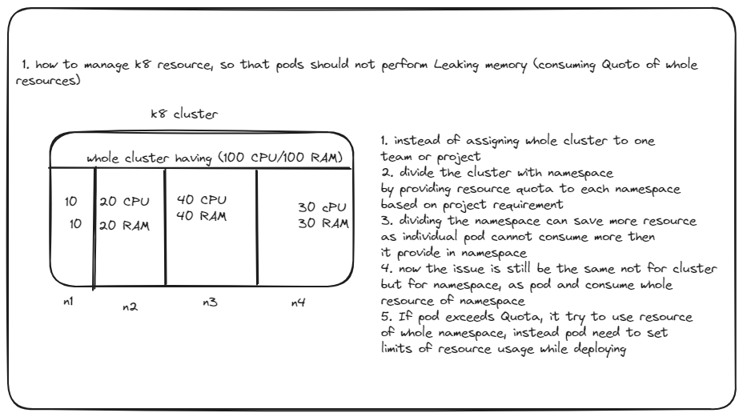

# welcome to best side of Documentation, this page contains some of the IMP things to know as a Developer

## GIT

### [Git Shallow](https://www.atlassian.com/git/tutorials/big-repositories)

- git shallow allows to clone large size repositories with lesser time.  
- a "shallow clone" refers to a clone of a repository that only contains a limited history of the repository's commits. When you perform a shallow clone, Git retrieves only a subset of the commits from the remote repository, truncating the history beyond a certain depth. This can be useful when you are only interested in the recent history of a project and don't need the entire commit history.  
    The --depth option is used to specify the depth of the clone, i.e., the number of most recent commits to fetch. For example:  
    ```git clone --depth 1 <repository-url>```  
- To convert a shallow clone to a full clone with the entire commit history, you can use command:  
```git fetch --unshallow```

### [Git lfs](https://www.atlassian.com/git/tutorials/git-lfs)

- Git LFS (Large File Storage) is an extension to Git that deals with large files by replacing them with text pointers inside the Git repository, while storing the actual file content in an external storage system. This allows you to version control large binary files, such as audio, video, datasets, and other large assets, without causing significant bloat in your Git repository.

## Docker

### [CMD Vs ENTRYPOINT](https://medium.com/container-talks/understand-cmd-and-entrypoint-differences-in-docker-d11105cc5454#id_token=eyJhbGciOiJSUzI1NiIsImtpZCI6IjdkMzM0NDk3NTA2YWNiNzRjZGVlZGFhNjYxODRkMTU1NDdmODM2OTMiLCJ0eXAiOiJKV1QifQ.eyJpc3MiOiJodHRwczovL2FjY291bnRzLmdvb2dsZS5jb20iLCJhenAiOiIyMTYyOTYwMzU4MzQtazFrNnFlMDYwczJ0cDJhMmphbTRsamRjbXMwMHN0dGcuYXBwcy5nb29nbGV1c2VyY29udGVudC5jb20iLCJhdWQiOiIyMTYyOTYwMzU4MzQtazFrNnFlMDYwczJ0cDJhMmphbTRsamRjbXMwMHN0dGcuYXBwcy5nb29nbGV1c2VyY29udGVudC5jb20iLCJzdWIiOiIxMTQ1Mzc2NzM5NjYzNjY4NTAyNjIiLCJlbWFpbCI6ImRvbnRhc2tlbWFpbGFkZHJlc3NAZ21haWwuY29tIiwiZW1haWxfdmVyaWZpZWQiOnRydWUsIm5iZiI6MTY5Nzk3ODI3MiwibmFtZSI6IkJvdGxhIFJhbSIsInBpY3R1cmUiOiJodHRwczovL2xoMy5nb29nbGV1c2VyY29udGVudC5jb20vYS9BQ2c4b2NMNGMyWXZLXzFlSllMX3ZLX3drSWFiREx0c3dYeWFadzU0MF91UjBTT1E9czk2LWMiLCJnaXZlbl9uYW1lIjoiQm90bGEiLCJmYW1pbHlfbmFtZSI6IlJhbSIsImxvY2FsZSI6ImVuLUdCIiwiaWF0IjoxNjk3OTc4NTcyLCJleHAiOjE2OTc5ODIxNzIsImp0aSI6IjAwZWMxMjA1MDYwOTNiYzcwZDk3N2RmMzM2M2IxNjlmYWRjOGZhNTYifQ.hYAhN7EWsZTI6H-Fscm1-5ykfRTcCBpYr2KBKZjyY75PJr_y1IcmTgA3F3KIJhFiSBOjXP3xuUpBkuKLBuyMIPP_DLJYwobjVlyX3Cftalqw-R9lAZvTkBpplboLL0G4zKl4mC1Rk1-WgI0tI1Bc7NSHSTKYIEFuCQcBskuvUspNdZyQBvgpHJznTsAcZKtvhM5TP4ya1JLmjwJcqtjEroyqlxNtoLFuBf5LRlmp0Dxtn6niImG84yCt4v7yzNS93OCuqT6rEczF_ZqkD8zNG9WaH7Fsgz6KwIuUH0bGYcVtGt9GbFrSSyAqXfii0a2ZMM39bv9ywsfc-2lZqJXMVQ)

- CMD and ENTRYPOINT are instructions used in Dockerfiles to define the command that will be run when a container is started. However, they serve different purposes and have distinct behaviors.

- CMD Instruction:

The CMD instruction in a Dockerfile sets the default command and/or parameters for the container. It provides defaults for an executing container, but these defaults can be overridden by specifying the command and parameters at runtime when the container is started.

```shell
FROM ubuntu:latest  
CMD ["echo", "Hello, World!"]  
```

In this example, if no command is specified when running the container, it will execute the default echo "Hello, World!". However, a user can override the CMD instruction by specifying a different command when running the container:

```docker run my-image echo Goodbye, World!```

- ENTRYPOINT Instruction:

The ENTRYPOINT instruction in a Dockerfile sets the main command to be run when the container starts. Unlike CMD, the ENTRYPOINT instruction does not allow for default parameters that can be overridden. Instead, any parameters specified at runtime are passed as arguments to the command defined in ENTRYPOINT.

```shell
FROM ubuntu:latest
ENTRYPOINT ["echo", "Hello, World!"]  
```

In this example, if no command is specified when running the container, it will execute the default echo "Hello, World!". However, if a user provides a command, it will be treated as arguments to the ENTRYPOINT:  
```docker run my-image "Goodbye, World!"```

### [Docker-Squash](http://jasonwilder.com/blog/2014/08/19/squashing-docker-images/)

- In this article, detailed explain about Image Layering and how to use docker-squash command to reduce the size of Image.

### [Automated Nginx Reverse Proxy for Docker](http://jasonwilder.com/blog/2014/03/25/automated-nginx-reverse-proxy-for-docker/)

### [Dockerizer](https://alex.dzyoba.com/blog/packer-for-docker/)

- Dockerizer is the concept to use Docker in more efficient way, so that developer and reuse the code and additional install packages as per dependency.  

- Reason for using Dockerizer:  
    1. in Dockerfile each RUN command create new layer (which can create huge Image size while pushing to Registry)  
    2. Dockerizer contains Ansible & Packer concept which then help to create Image more efficient way,  installing required dependency/packages and making code reusability.

## Kubernetes

### [Storage Class and Persistent Volume](https://medium.com/devops-mojo/kubernetes-storage-options-overview-persistent-volumes-pv-claims-pvc-and-storageclass-sc-k8s-storage-df71ca0fccc3)

### [Goodbye etcd, Hello PostgreSQL: Running Kubernetes with an SQL Database](https://martinheinz.dev/blog/100)

- etcd is the brain of every Kubernetes cluster, the key-value storage keeping track of all the objects in a cluster. It's intertwined and tightly coupled with Kubernetes, and it might seem like an inseparable part of a cluster, or is it?

    In this article it is explained how we could replace etcd with PostgreSQL database, as well as why and when it might make sense to do so.

### Migrate data from one PVC to other (this can done within same Namespace)

- well, for hostin any web applications or storing output files we need some kind of dataStorage. At some point our local storage wont be efficient approach when it comes to Prod Version & for multiple user.

- Thanks to Cloud Service Companies, that provides the data-storage here there are many Storageclass available from where we can store and retrieve our data. Some of the StorageClass as AzureFile, AzureBlob, net-trident-nfs.

- Infact, backup and mounting data from one storage to Storage, has became a easy job todo.

- here is the simple code snippet to create a StorageClass, PVC
    1. Create StorageClass yaml

    ```yaml
    kind: StorageClass
    apiVersion: storage.k8s.io/v1beta1
    metadata:
        name: storageclassname
    provisioner: csi.trident.netapp.io
    parameters:
        resourceGroup: resourcegrpname #if required
        snapshots: 'false'             #if required
    reclaimPolicy: Retain
    volumeBindingMode: Immediate
    ```

    2. create PVC pointing to storage class

    ```yaml
    kind: PersistentVolumeClaim
    apiVersion: v1
    metadata:
        name: pvcname
    specs:
        accessModes:
            - ReadWriteMany
        volumeMode: Filesystem
        resources:
            requests:
                storage: 10Gi
        storageClassName: name-of-storageclass
        volumeMode: Filesystem
    ```

    3. To copy data to new StorageClass we need to create a new PVC pointing to newStorageClass, the above PVC yaml snippets can be helpful to create new PVC

    4. Once PVC gets create, nxt is to start copying PVC by deploying helper job. Here we need to mention two PVC name for copying data from src to destination in Job

    5. helper Job yaml file for copying data ( in this Job we need to mention to folder path within the pod to copy files one PVC to other)

    ```yaml
    apiVersion: batch/v1
    kind: Job
    metadata:
        name: job-name
    spec:
        parallelism: 1
        completions: 1
        activeDeadlineSeconds: 1800
        backoffLimit: 5
        template:
            metadata:
            labels:
                app: job-name
            spec:
                volumes:
                    - name: src
                    persistentVolumeClaim:
                        claimName: srcPVC-name  #from where data need to copy
                    - name: dst
                    persistentVolumeClaim:
                        claimName: dstPVC-name  #data to be copied
                containers:
                - name: copy-data
                image: ubuntu/busybox
                command: ["/bin/bash","-c"]
                args: ["cp -R /src/* /dst/"]  # using cp command
                args: ["rsync -a --progress --dry-run /mnt/src/ /mnt/dst/; echo 'will sleep now for 120 seconds. To stop process delete job..'; sleep 120; rsync -a --progress /mnt/src/ /mnt/dst/; echo 'rsync process fininshed'"]        #using rsync 
                volumeMounts:
                    - name: src
                    mountPath: "/mnt/src"
                    - name: dst
                    mountPath: "/mnt/dst"
                restartPolicy: OnFailure
    ```

    6. to execute the job ```oc apply -f job.yaml```

### [Fetch secrets from Az-KeyVault to use secrets in Pods](https://azure.github.io/secrets-store-csi-driver-provider-azure/docs/getting-started/)

- as secrets key plays a vital role when its comes to use credentials for authentication purpose and various implement.

- Here [Azure-KeyVault](https://learn.microsoft.com/en-us/azure/key-vault/general/overview) is one of the best service for (Iaas,Saas,Paas) , using Az we can also store secret values.

- Azure Key Vault provider for Secrets Store CSI Driver allows you to get secret contents stored in an Azure Key Vault instance and use the Secrets Store CSI driver interface to mount them into Kubernetes pods.

- Following steps mentioned about fetching KV from Azure

    ```yaml
    ##add helm repo for Secrets Store CSI Driver and the Azure Keyvault Provider
    helm repo add csi-secrets-store-provider-azure https://azure.github.io/secrets-store-csi-driver-provider-azure/charts

    # deploy the secret-store-csi-driver and Azure KV Provider
    helm install csi csi-secrets-store-provider-azure/csi-secrets-store-provider-azure

    Note: The helm charts hosted in Azure/secrets-store-csi-driver-provider-azure repo include the 
    Secrets Store CSI Driver helm charts as a dependency. Running the above helm install command
    will install both the Secrets Store CSI Driver and Azure Key Vault provider

    # ensure driver and provider pods are running
    kubectl get pods

    #if using service principal connection (Configure Service Principal to access Keyvault)
    Add your service principal credentials as a Kubernetes secrets

    oc create secret generic secrets-store-creds --from-literal clientid=<service_principal_client_id>

    or deploy by using yaml

    kind: Secret
    apiVersion: v1
    metadata:
        name: service-principal
        lables:
            #update labels
    data:
        clientid:
        clientsecret:
    type: Opaque

    # secret class provider yaml
    apiVersion: secrets-store.csi.x-k8s.io/v1
    kind: SecretProviderClass
    metadata:
        name: azure-kv
    spec:
    provider: azure
    parameters:
        usePodIdentity: "false"               # [OPTIONAL] if not provided, will default to "false"
        useVMManagedIdentity: "false"         # [OPTIONAL available for version > 0.0.4] if not provided, will default to "false"
        userAssignedIdentityID: "client_id"   # [OPTIONAL available for version > 0.0.4] use the client id to specify which user assigned managed identity to use. If using a user assigned identity as the VM's managed identity, then specify the identity's client id. If empty, then defaults to use the system assigned identity on the VM
        clientID: "client_id"                 # [OPTIONAL available for version > 1.1.0] client id of the Azure AD Application or managed identity to use for workload identity
        keyvaultName: "kvname"                # the name of the KeyVault
        cloudName: ""                         # [OPTIONAL available for version > 0.0.4] if not provided, azure environment will default to AzurePublicCloud
        cloudEnvFileName: ""                  # [OPTIONAL available for version > 0.0.7] use to define path to file for populating azure environment
        objects:  |
        array:
            - |
            objectName: secret1
            objectAlias: SECRET_1           # [OPTIONAL available for version > 0.0.4] object alias
            objectType: secret              # object types: secret, key or cert. For Key Vault certificates, refer to https://azure.github.io/secrets-store-csi-driver-provider-azure/configurations/getting-certs-and-keys/ for the object type to use
            objectVersion: ""               # [OPTIONAL] object versions, default to latest if empty
            objectVersionHistory: 5         # [OPTIONAL] if greater than 1, the number of versions to sync starting at the specified version.
            filePermission: 0755                # [OPTIONAL] permission for secret file being mounted into the pod, default is 0644 if not specified.
            - |
            objectName: key1
            objectAlias: ""                 # If provided then it has to be referenced in [secretObjects].[objectName] to sync with Kubernetes secrets 
            objectType: key
            objectVersion: ""
        tenantID: "tid"                       # the tenant ID of the KeyVault

    # deploy pod
    kind: Pod
    apiVersion: v1
    metadata:
        name: demo-pod
    spec:
        containers:
        - image: nginx
            name: nginx
        volumeMounts:
        - name: secrets-store-inline
        mountPath: "/mnt/secrets-store"
        readOnly: true
        volumes:
            - name; secrets-store-inline
            csi:
                driver: secrets-store.csi.k8s.io
                readOnly: true
                volumeAttributes:
                    secretProvider: "azure-kv"
                nodePublishSecretRef:              #only required if using service principal          
                    name: "secret-yaml-metadata-name" #only required if using service principal 
    (note: didnt specified commands for pod, pod will completed as soon as hosted)
    
    # deploy pod
    kubectl apply -f pod.yaml

    # check pod status
    kubectl get pods

    # show secrets held in secrets-store
    kubectl exec "pod-name" -- ls /mnt/secrets-store/

    # print a test secret held in secrets-store
    kubectl exec "pod-name" -- cat /mnt/secrets-store/secret1
    ```

### Volume Snapshot

- volume snapshot using Openshift, this feature assist to create a snap of volume in given time, so that those volume can utilised for test/prod by specifying the volumesnapshot name

- following are steps to create Snapshot using Openshift
  
    1. select PVC for which you want to take snapshot, click on the options and select "create Snapshot"
    

    2. Select the "VolumeSnapshotClass" (will be provided by Openshift)
    note : for creating volumeSnapshot, a VolumeSnapshotClass should be available.
    

    3. select "Create"
    

    4. after successful creation of snapshots, verify it by selecting VolumeSnapshots
      

    5. now to restore the volumeSnapshot, create a new PVC (provided in options).
    

    6. select the StorageClass for PVC
    

    7. after successful creation of PVC , verify it by selecting PersistentVolumeClaims
    

    8. now to use volume create by VolumeSnapshot, update the PVC name to pod, which is created using VolumeSnapshot.
    

### Deployment rollout strategies

[tutorial link](https://www.youtube.com/watch?v=lxc4EXZOOvE&t=95s)

[byte-byte go link](https://www.youtube.com/watch?v=AWVTKBUnoIg)

[source-code link](https://github.com/antonputra/tutorials/tree/main/lessons/171)

### HPA vs KEDA

To share these hard-earned lessons with you. In this article, we're going to dissect HPA and KEDA, compare their strengths and weaknesses, and dive into real-world scenarios. My goal is to arm you with the knowledge to make informed decisions right from the get-go, so you know exactly when to use HPA and when to switch gears to KEDA.

- What is HPA?

HPA automatically adjusts the number of pod replicas in a deployment or replica set based on observed metrics like CPU or memory usage. You set a target—like 70% CPU utilization—and HPA does the rest, scaling the pods in or out to maintain that level. It's like putting your scaling operations on cruise control.

- Why Was HPA Devised?

Back in the day, before the cloud-native era, scaling was often a manual and painful process. You'd have to provision new servers, configure them, and then deploy your application. This was time-consuming, error-prone, and not very agile.

When Kubernetes came along, it revolutionized how we think about deploying and managing applications. But Kubernetes needed a way to handle automatic scaling to truly make the platform dynamic and responsive to the actual needs of running applications. That's where HPA comes in.

Simplicity: HPA is designed to be simple and straightforward. You don't need a Ph.D. in distributed systems to set it up. Just specify the metric and the target, and you're good to go.

Resource Efficiency: Before autoscaling, you'd often over-provision resources to handle potential spikes in traffic, which is wasteful. HPA allows you to use resources more efficiently by scaling based on actual needs.

Operational Ease: With HPA, the operational burden is reduced. You don't have to wake up in the middle of the night to scale your application manually; HPA has got your back.

Built-In Metrics: Initially, HPA was designed to work with basic metrics like CPU and memory, which are often good enough indicators for many types of workloads.

So, in a nutshell, HPA was devised to make life easier for DevOps folks like us, allowing for more efficient use of resources and simplifying operational complexities. It's like the Swiss Army knife of Kubernetes scaling for straightforward use-cases. What do you think? Want to dive deeper into any aspect of HPA?

So... When to Use HPA?
Predictable Workloads: If you're dealing with an application that has a fairly predictable pattern—like a web app that gets more traffic during the day and less at night—HPA is a solid choice. You can set it to scale based on CPU or memory usage, which are often good indicators of load for these types of apps.

Simple Metrics: HPA is great when you're looking at straightforward metrics like CPU and memory. If you don't need to scale based on more complex or custom metrics, HPA is easier to set up and manage.

Quick Setup: If you're in a situation where you need to get autoscaling up and running quickly, HPA is your friend. Being a native Kubernetes feature, it's well-documented and supported, making it easier to implement.

Stateless Applications: HPA is particularly well-suited for stateless applications where each pod is interchangeable. This makes it easier to scale pods in and out without worrying about maintaining state.

Built-In Kubernetes Support: Since HPA is a built-in feature, it comes with the advantage of native integration into the Kubernetes ecosystem, including monitoring and logging through tools like Prometheus and Grafana.

- What is KEDA?

KEDA stands for Kubernetes Event-Driven Autoscaling. Unlike HPA, which is more about scaling based on system metrics like CPU and memory, KEDA is designed to scale your application based on events. These events could be anything from the length of a message queue to the number of unprocessed database records.

KEDA works by deploying a custom metric server and custom resources in your Kubernetes cluster. It then integrates with various event sources like Kafka, RabbitMQ, Azure Event Hubs, and many more, allowing you to scale your application based on metrics from these systems.

- Why Was KEDA Devised?

Event-Driven Architectures: Modern applications are increasingly adopting event-driven architectures, where services communicate asynchronously through events. Traditional autoscalers like HPA aren't designed to handle this kind of workload.

Complex Metrics: While HPA is great for simple metrics, what if you need to scale based on the length of a Kafka topic or the number of messages in an Azure Queue? That's where KEDA comes in.

Zero to N Scaling: One of the coolest features of KEDA is its ability to scale your application back to zero when there are no events to process. This can lead to significant cost savings.

Extensibility: KEDA is designed to be extensible, allowing you to write your own scalers or use community-contributed ones. This makes it incredibly flexible and adaptable to various use-cases.

Multi-Cloud and On-Premises: KEDA supports a wide range of event sources, making it suitable for both cloud and on-premises deployments.

The Gap that KEDA Fills Over HPA
While HPA is like your reliable sedan, KEDA is more like a tricked-out sports car with all the bells and whistles. It was devised to fill the gaps left by HPA, particularly for applications that are event-driven or that require scaling based on custom or external metrics.

So, if you're dealing with complex, event-driven architectures, or if you need to scale based on metrics that HPA doesn't support out of the box, KEDA is your go-to. It's like the next evolution in Kubernetes autoscaling, designed for the complexities of modern, cloud-native applications.

#### Real-World Scenarios

Real Cases for Using HPA Over KEDA

1. Basic Web Application
Scenario: You're running a simple web application that serves static content and has predictable spikes in traffic, like during a marketing campaign.

In this case, the scaling needs are straightforward and based on CPU or memory usage. HPA is easier to set up and manage for this kind of scenario. You don't need the event-driven capabilities that KEDA offers.

2. Internal Business Application

Scenario: You have an internal application used by employees for tasks like data entry, which sees higher usage during business hours and lower usage otherwise.

Again, the load pattern is predictable and can be managed easily with simple metrics like CPU and memory. HPA's native integration with Kubernetes makes it a straightforward choice, without the need for the more complex setup that KEDA might require.

3. Stateless Microservices

Scenario: You're running a set of stateless microservices that handle tasks like authentication, logging, or caching. These services have a consistent load and don't rely on external events.

These types of services often scale well based on system metrics, making HPA a good fit. Since they're stateless, scaling in and out is less complex, and HPA can handle it easily.

4. Traditional RESTful API

Scenario: You have a RESTful API that serves mobile or web clients. The API has a steady rate of requests but might experience occasional spikes.

In this case, you can set up HPA to scale based on request rates or CPU usage, which are good indicators of load for this type of application. KEDA's event-driven scaling would be overkill for this scenario.

Why Choose HPA in These Cases?
Simplicity: HPA is easier to set up and manage for straightforward scaling needs. If you don't need to scale based on complex or custom metrics, HPA is the way to go.

Native Support: Being a built-in Kubernetes feature, HPA has native support and a broad community, making it easier to find help or resources.

Resource Efficiency: For applications with predictable workloads, HPA allows you to efficiently use your cluster resources without the need for more complex scaling logic.

Operational Ease: HPA requires less ongoing maintenance and has fewer components to manage compared to KEDA, making it a good choice for smaller teams or simpler applications.

Real Cases for Using KEDA Over HPA

1. Event-Driven ML Inference
Scenario: You have a machine learning application for real-time fraud detection. Transactions are events funneled into an AWS SQS queue.

Why KEDA Over HPA: With KEDA, you can dynamically adjust the number of inference pods based on the SQS queue length, ensuring timely fraud detection. HPA's system metrics like CPU or memory wouldn't be as effective for this use-case.

2. IoT Data Processing

Scenario: Your IoT application collects sensor data that's sent to an Azure Event Hub for immediate processing.

Why KEDA Over HPA: Here, KEDA's strength lies in its ability to adapt to the number of unprocessed messages in the Azure Event Hub, ensuring real-time data processing. Traditional HPA scaling based on CPU or memory wouldn't be as responsive to these event-driven requirements.

3. Real-time Chat Application

Scenario: You manage a chat application where messages are temporarily stored in a RabbitMQ queue before being delivered to users.

Why KEDA Over HPA: KEDA excels in this scenario by dynamically adjusting resources based on the RabbitMQ queue length, ensuring prompt message delivery. This is a level of granularity that HPA, with its focus on system metrics, can't offer.

4. Stream Processing with Kafka

Scenario: Your application consumes messages from a Kafka topic, and the rate of incoming messages can fluctuate significantly.

Why KEDA Over HPA: In this case, KEDA's ability to scale based on the Kafka topic length allows it to adapt to varying loads effectively. HPA, which isn't designed for such custom metrics, wouldn't be as agile.

Why Choose KEDA in These Cases?
Event-Driven Flexibility: KEDA is tailored for scenarios where system metrics aren't the best indicators for scaling, offering a more nuanced approach.

Custom Metrics Support: Unlike HPA, KEDA can interpret a wide range of custom metrics, making it versatile for complex scaling needs.

Resource Optimization: KEDA's ability to scale down to zero pods when idle can lead to significant cost savings.

Adaptability: The platform's extensible design allows for custom scalers, making it adaptable to a wide range of use-cases.

- Conclusion

So there you have it, folks! We've journeyed through the world of Kubernetes autoscaling, dissecting both HPA and KEDA to understand their strengths, limitations, and ideal use-cases. From my early days of being enamored with HPA's simplicity to discovering the event-driven magic of KEDA, it's been a ride full of lessons.

If you're dealing with predictable workloads and need a quick, straightforward solution, HPA is your reliable workhorse. It's like your trusty old hammer; it might not have all the bells and whistles, but it gets the job done efficiently.

On the flip side, if your application lives in the fast-paced realm of event-driven architectures or requires scaling based on custom metrics, KEDA is your Swiss Army knife. It's built for the complexities and nuances of modern, cloud-native applications.

Remember, choosing between HPA and KEDA isn't about which is better overall, but which is better for your specific needs. So take stock of your application's requirements, your team's expertise, and your long-term scaling strategy before making the call.

As you venture into your next Kubernetes project, I hope this guide serves as a useful roadmap for your autoscaling decisions. And hey, since you're all about diving deeper, maybe explore setting up these autoscaling strategies in a hands-on way. Trust me, there's no better teacher than experience.

### How to fix K8 deployement



### Scenario based questions

1. how to manage k8 resource (so that pods should not exceeds resources / should not consume
whole cluster/namespace Quota



2. how to upgrade k8 version

got through blog [here](https://devopscube.com/setup-kubernetes-cluster-kubeadm/)

3. how to fix StatefulSet with Persistent Volume not working after Cloud Migration

https://www.youtube.com/watch?v=uBhjymTV0ro&t=1220s
