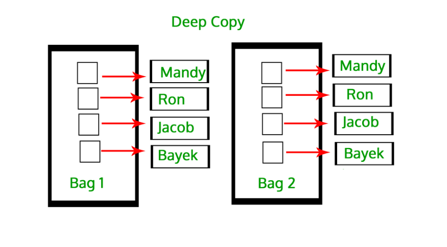
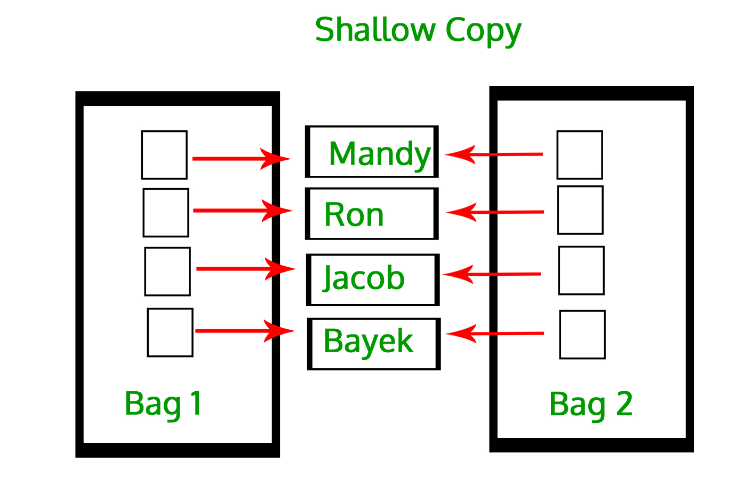

# Python

All about python modules, syntax and function

## Virtual Environment

```bash
# Create a virtual environment
python -m venv myenv

# Activate the virtual environment
source myenv/bin/activate  # On Unix or MacOS

myenv\Scripts\activate  # On Windows

# Deactivate the virtual environment
deactivate
```

## Package Management

```bash
# Install a package
pip install package_name

# List installed packages
pip list

# Create requirements.txt
pip freeze > requirements.txt

# Install packages from requirements.txt
pip install -r requirements.txt
```

## For-loop

```python
# print even
list=[4,5,25,6,8,8,9,2,2,3,97,52,96,32,84,19]
for i in list:
    if i%2 == 0:
        print(i, end="")
        
# using while loop
candy=10
withdrawal=12
i=1
while i <= withdrawal:
    if i > candy:
        print(f"{i} : out of stock")
        break
    print(f"{i} : withdrawal")
    i+=1

# create list by taking input from user

list=[]
enter_range=int(input("enter the range to create list of elements"))
for i in range(enter_range):
    enter_num=input(f"enter element {i+1} :")
    list.append(enter_num)
print(list)
```

## Args and Kwargs

```python
##args

def sum(*args):
    total = 0
    for i in args:
        total = total+i
    print(total)

sum(5,6,7,8,9)  ##we can pass n number of arguments

###for key word arguments
 
def student(**data):
    for key,value in data.items():
        print(f"{key} {value}")
   
##callable = student(key=value,key=value)

student(name="John",age=30)
student(name="Ram",age=26)

```

## Dictionary

```python
person = {
    "name":"ram",
    "age":25,
    "gender":"male",
    "profession":"engineer"
}

## find value with key
print(person.get("age"))

##print all dict
print(person)

#or using for loop
for i,j in person.items():
    print(f"keys: {i} , values :{j}")
    
##print all keys
print(person.keys())

##print all values
print(person.values())

##items return list containing all values in tuple 
print(person.items())


##update dict
person.update({"salary":"100000"})
print(person)

print(person.get("amount"))
```

## Functional Programming

### Lambda


```text
syntax > lambda arguments : expression 
```

```python
##passing argument in lambda

numbers=[2,4,6,8,10]

def multiple(x):

    for i in x:
        i=i*2
        print(i,end=" ")

multiple(numbers)

##passing argument in lambda using map
 
doubled_map = list(map(lambda x : x*2,nums))
print(doubled_map)
```

### Filter

The filter() function applies a given function (like a lambda function) to each element of an iterable and filters the elements for which the function returns True. It returns a filter object (which can be converted to a list).

Purpose: To select elements that meet a condition (i.e., elements for which the filtering function returns True).
Use Case: When you want to filter out elements that don't satisfy a condition or predicate.

```python
##filter is similar to mapping
 
nums_list = [1,2,3,4,5,6,7,8,9]
even=[]
for x in nums_list:
    if x % 2 == 0:
        even.append(x)

print(even)
 
#with filter
 
def even(x):
    return x%2==0
 
even_list= list(filter(even,nums_list))
print(even_list)
```

### Mapping

The map() function applies a given function (like a lambda function) to every element of an iterable (e.g., list, tuple) and returns a map object (which can be converted to a list).

Purpose: To transform or modify each element in the iterable.
Use Case: When you want to apply a function to all elements, such as performing operations, transformations, or conversions on each element.

```python
double_num = []
numbers = (5,6,7,8,9)

for num in numbers:
    double_num.append(num * 2)

print(double_num)
 
##using map

def double(num):
    return num*2
 
double_List = list(map(double,numbers))
print(double_List)
```

### List Comprehension

```text
syntax > [return-value for-loop if-condition]

```

```python
## with out list comprehension 
## print number which are divisible by 3

ls=[]
for i in range(100):
    if i%3==0:
        ls.append(i)
print(ls)

## using list comprehension

ls=[i for i in range(100) if i%3==0]
print(ls)
```

### Dictionary Comprehension

```text
syntax > {return-value for-loop if-condition}
```

```python

dict1={i:f"item{i}" for i in range(100)}
print(dict1)

nums_List=[5,6,7,8]

## list comprehension for maping

mapping = list(x*2 for x in nums_List)
print(mapping)
 
## list comprehension for filtering

filtering = list(x for x in nums_List if x%2==0)
print(filtering)
```

## Iteration

Iteration just means looping through something — like a list, tuple, or string — one item at a time.

In Python, objects you can loop through (like lists, strings, etc.) are called iterables.

To actually get each item one by one, Python uses something called an iterator.

Example: Iteration using a list

```python
fruits = ["apple", "banana", "cherry"]

# normal for loop (uses iteration internally)
for fruit in fruits:
    print(fruit)
```

Output:

```bash
apple
banana
cherry
```

How it works internally

You can use **iter()** and **next()** to see what’s happening under the hood:

```python
fruits = ["apple", "banana", "cherry"]
iterator = iter(fruits)  # get an iterator object

print(next(iterator))  # apple
print(next(iterator))  # banana
print(next(iterator))  # cherry
# print(next(iterator))  # would raise StopIteration error
```

Each time you call next(), Python gives the next item until there’s nothing left.

## Generator

A generator is a special kind of iterator that you create yourself using a function and the yield keyword.

Generators don’t store all values in memory — they generate one value at a time and remember where they left off.

That means they’re great for large datasets or infinite sequences.

Example

```python
def count_up_to(n):
    count = 1
    while count <= n:
        yield count     # yield pauses the function and returns a value
        count += 1

# create generator
numbers = count_up_to(3)

print(next(numbers))  # 1
print(next(numbers))  # 2
print(next(numbers))  # 3
# print(next(numbers))  # StopIteration
```

Each yield gives one value, then pauses the function until the next call.

Using a generator in a loop

```python
for num in count_up_to(3):
    print(num)
```

Output:

```bash
1
2
3
```

🧩 Small Real Example

```python
def read_file(filename):
    with open(filename) as f:
        for line in f:
            yield line.strip()  # one line at a time

# create generator object once
lines = read_file("test.txt")

# now read lines one by one
print(next(lines))
print(next(lines))
print(next(lines))
print(next(lines))

## or

def read_file(filename):
    with open(filename) as f:
        for line in f:
            yield line.strip()  # one line at a time

for line in read_file("big_log.txt"):
    print(line)
```

## Decorator

Decorators are a powerful and elegant feature in Python that allows you to modify or extend the behavior of functions or methods without changing their actual code.

```python
def first(func):    ##passing the func as an argument
    def second():
        print("execute the first line")
        func() ##call the funct
        print("execute the second line")
    return second()
   
@first   ###decorate
def middle():
    print("execute the middle line")
   
# mid = first(middle)  ##another way to call decorate
middle()
```

## Manage Files

Using open function (in this function you need to explictly close the function with close())

```python
f = open("./read_write_demo.txt","r")  ##r=read
print(f.read())   ##read() to print the txt 
f.close() ##close
```

Using with open function

```python
def download(url,name):
    print(f"downloading {name} from {url}")
    response=requests.get(url)
    with open(f"{name}.jpg","wb") as f:
        f.write(response.content)
    print(f"download {name} finished")
```

## Specail Variables

if __name__ == "__main__":

File: example.py

```python
def greet():
    print("Hello from greet()!")

print("Top-level code is running!")

if __name__ == "__main__":
    print("This runs only when example.py is executed directly.")
    greet()
```

If you run directly: python example.py

Output:

```bash
Top-level code is running!
This runs only when example.py is executed directly.
Hello from greet()!
```

If you import it in another file as > import example

Output:

```bash
Top-level code is running!
```

👉 Notice that the part under if __name__ == "__main__": did not run!

**__new__**

__new__ is a special method for object creation in Python. It is called before __init__ and is responsible for creating a new instance.  
Rarely overridden unless you need control over object creation (e.g., implementing singletons, immutable objects, or metaclasses).

Basic example:

```python
class MyClass:
    def __new__(cls, *args, **kwargs):
        print("Creating instance...")
        instance = super().__new__(cls)  # Actually create the instance
        return instance

    def __init__(self, value):
        print("Initializing instance...")
        self.value = value

obj = MyClass(42)
```

Output:

```bash
Creating instance...
Initializing instance...
```

✅ Key points:

__new__ returns the new instance.

__init__ initializes the instance.

__new__ is more "low-level" than __init__.

Concept	Role

__name__	Tells whether a module is run directly (__main__) or imported
__main__	Special name for the top-level script
__new__	Responsible for creating a new instance of a class

## Logging

```python
import logging

##using getlogger to create seperate log files
logger=logging.getLogger(__name__)
logger.setLevel(logging.INFO) ##set logging level

## formatter is to set logs format
log_format=logging.Formatter("%(asctime)s - %(levelname)s - %(message)s")

## fileHandler is user to create a file
log_file=logging.FileHandler("example.log")

log_file.setFormatter(log_format)
logger.addHandler(log_file)

## further code
def something():
    logger.info("this is a something function")
```

## Deep and Shallow Copy

Deep copy

In the case of deep copy, a copy of the object is copied into another object. It means that any changes made to a copy of the object do not reflect in the original object.



Shallow copy

In Shallow copy, a reference of an object is copied into another object. It means that any changes made to a copy of an object do reflect in the original object



## Public, Protected and Private Methods

Public, Private, and Protected are access modifiers that define how variables and methods of a class can be accessed.

- **Public**
Access Level: No restrictions. Public members can be accessed from anywhere—inside or outside the class.

Convention: Any attribute or method without an underscore prefix is considered public.  

```python
class MyClass:
    def __init__(self):
        self.public_var = "I am public"

obj = MyClass()
print(obj.public_var)  # Accessible
```

- **Protected**

Access Level: Meant to be accessible only within the class and its subclasses. However, it can still be accessed outside the class (Python doesn’t enforce strict access control).

Convention: Single underscore `_` prefix is used to indicate a protected member. This is just a convention and not strictly enforced.

```python
class MyClass:
    def __init__(self):
        self._protected_var = "I am protected"

class SubClass(MyClass):
    def access_protected(self):
        return self._protected_var

obj = MyClass()
print(obj._protected_var)  # Accessible (but not recommended)

sub_obj = SubClass()
print(sub_obj.access_protected())  # Proper way to access protected members
```

- **Private**

Access Level: Accessible only within the class. Private members are not directly accessible outside the class.  
Convention: Double underscore `__` prefix is used to make an attribute private.

Name Mangling: Python "mangles" the name of private members to make them harder to access. This is done by renaming the member to _ClassName__attributeName.

```python
class Example:
    def __init__(self):
        self.__private_attribute = "I am private!"

    def __private_method(self):
        return "This is a private method!"

    def access_private(self):
        # Accessing private members within the class
        return self.__private_method()

obj = Example()

# Accessing private members directly will raise an AttributeError
# print(obj.__private_attribute)  # Uncommenting this will raise an error
# print(obj.__private_method())   # Uncommenting this will raise an error

# Accessing private members indirectly via a public method
print(obj.access_private())  # Allowed
```

## Class

### Basic class structure

__init__ is a special method, also known as a constructor, that is automatically called when a new instance (object) of a class is created. It is used to initialize the object's attributes (i.e., variables) and set up any necessary state.

```python
class Student:
    ##self hold the value of instant obj

    def __init__(self,name,age) -> None:   ##here self represent to b1
        self.name = name
        self.age = age
   
    def __str__(self) -> str:   ##__str__() function controls what should be returned when the class object is representd as string.
        return f"{self.name}"
 
    def hello(self):  ## funct is called methods in class
        print("heellooo")
 
    def get_name(self):
        return self.name
   
    def get_details(self):
        print("name",self.name)
        print("age",self.age)

   

## for every class we need to define obj
## here b1 var is obj for class Book

b1 = Student("RAM",26)  ##b1 here is obj
b1.hello()   ##obj.method
print(b1.get_name())    ##obj.method
b1.get_details()

 
b2=Student("Krishna",11)   ##use the same class by creating another obj
b2.get_details()
```

### Isinstance

```python

x = isinstance("Hello", (float, int, str, list, dict, tuple))
print(x)

```

```python
class Myclass:
    name = "John"

obj = Myclass()
x = isinstance(obj, Myclass)
```

### Dataclass

```python
#without dataclass

class Person():

    def __init__(self, first_name, last_name, age):
        self.first_name = first_name
        self.last_name = last_name
        self.age = age

person=Person("Ram","krishna",26)
print(person.first_name)
 
##with dataclass

from dataclasses import dataclass   ##import dataclass

@dataclass
class Book:

    title : str    ###variables are define without using __init__ instance
    author : str
    price : float
  
book=Book("Peaceofmind","Unknown",50.50)
print(book.price)
```

### Method-Static

Class method :A class method is a method which is bound to the class and not the object of the class.

Static method : A static method is used when we want to create a function without using self as instance-(just to create a independent function)

```python

from datetime import date

class Person:
    def __init__(self, name, age):
        self.name = name
        self.age = age
        
    # a class method to create a
    # Person object by birth year.
    @classmethod
    def fromBirthYear(cls, name, year):
        return cls(name, date.today().year - year)
    
    # a static method to check if a
    # Person is adult or not.
    @staticmethod
    def isAdult(age):
        return age > 18

    ##static method eg 2
    ##this function is independent of the class ,created without using self as instance
    @staticmethod
    def thankyou(msg):
        return msg

person1 = Person('ram', 21)
person2 = Person.fromBirthYear('ram', 1997)

print(person1.age)
print(person2.age)

# print the result
print(Person.isAdult(22))

# print thankyuu msg
print(Person.thankyou("thanks for looking up this file"))

```

### Inheritance

```python
class Publisher:

    def __init__(self,title,price) -> None:
        self.title=title
        self.price=price
 
class Author(Publisher):   ##add class name to inherit

    def __init__(self,title,price,pages,period) -> None:
        super().__init__(title,price)   ###add module super()to fetch the var for Publisher class
        self.period=period
        self.pages=pages
  
class Book1(Publisher):    ##add class name to inherit

    def __init__(self,title,price,author) -> None:
        super().__init__(title,price)
        self.author=author    ##adding variable rather then class
      
class Magazine1(Author):

    def __init__(self,title,author,pages,period) -> None:   ##using Author class to fetch the values
        super().__init__(title,author,pages,period)
      
class Newspaper1(Author):

    def __init__(self,title,price,pages,period) -> None:
        super().__init__(title,price,pages,period)

      
b1=Book1("PeaceofMind","Unknown",100)

m1=Magazine1("Vogue","Kiran",20,15)

n1=Newspaper1("TOI","toi",5,10)

print(b1.author)

print(m1.period)
```

### Polymorphism using Method-Overiding

Polymorphism in Python refers to the ability of different object types to be used interchangeably because they implement the same methods or behavior. It allows functions or methods to operate on objects of different types, as long as they support the same interface or method names.

```python
class Animal:
    def speak(self):
        raise NotImplementedError("Subclasses must implement this method")

class Dog(Animal):
    def speak(self):
        return "Woof!"

class Cat(Animal):
    def speak(self):
        return "Meow!"

# Creating objects of the child classes
dog = Dog()
cat = Cat()

# Both objects have a speak method, but they behave differently
print(dog.speak())  # Output: Woof!
print(cat.speak())  # Output: Meow!
```

In this example:

Both Dog and Cat are subclasses of Animal, and they override the speak() method to provide their own implementation.
The same method name (speak()) exhibits different behaviors depending on the object type.

## Async

In Python, async is used for asynchronous programming. It allows you to write code that can run tasks concurrently without blocking the execution of other code.

Normally, Python executes code line by line, which can be slow if some operations take time (like downloading a file or waiting for a database).

With async, you can start a task, let other tasks run while waiting, and come back to the first task when it’s done.

This is particularly useful for I/O-bound operations (network calls, file reading, API calls) but not for CPU-bound operations.

Core concepts

- async def: Defines an asynchronous function (also called a coroutine).
- await: Waits for a coroutine to finish without blocking the event loop.
- asyncio: Python’s built-in library to run async tasks concurrently.

Example

```python
import asyncio

# Define an async function
async def say_hello():
    print("Hello")
    await asyncio.sleep(2)  # Simulate a 2-second I/O operation
    print("World!")

# Another async function
async def say_numbers():
    for i in range(5):
        print(i)
        await asyncio.sleep(1)

# Main coroutine
async def main():
    # Run tasks concurrently
    task1 = asyncio.create_task(say_hello())
    task2 = asyncio.create_task(say_numbers())

    # Wait for both tasks to finish
    await task1
    await task2

# Run the main coroutine
asyncio.run(main())
```

Output

```bash
Hello
0
1
2
World!
3
4
```

What happens here:

1. say_hello() waits for 2 seconds without blocking other tasks.
2. say_numbers() continues printing numbers every second.

Async is not parallelism (no multiple CPU cores), it's concurrency (efficient waiting for I/O).

## Multithreading

Multithreading means running multiple threads (smaller units of a process) at the same time within a single program.  
Each thread can perform a task — for example, downloading files, processing data, or handling network requests — concurrently.

Why Use Multithreading?

1. Multithreading helps when your program spends a lot of time waiting — such as:
2. Downloading data from the internet
3. Reading/writing files
4. Waiting for user input
5. Talking to a database or API

Python threads share the same memory, so they can communicate easily.

Important:
Due to Python’s GIL (Global Interpreter Lock), true parallel CPU computation is limited.
But for I/O-bound tasks (like network or disk operations), multithreading gives a big speed boost.

🧩 How to Use Multithreading (Simple Example)

```python
### example 1

import threading
import time

def func(seconds):
    print(f"executing function {seconds}")
    time.sleep(seconds)

t1 = threading.Thread(target=func,args=[4])

t2 = threading.Thread(target=func,args=[6])

time1=time.perf_counter()

## start multithreading
t1.start()
t2.start()

## wait until background process complete
t1.join()
t2.join()

time2=time.perf_counter()
print(time2-time1)

### example2
import threading
import time

def worker(task_id):
    print(f"Thread {task_id} starting...")
    time.sleep(2)  # Simulate some work
    print(f"Thread {task_id} finished!")

# Create a list to hold our threads
threads = []

# Create and start 3 threads
for i in range(3):
    t = threading.Thread(target=worker, args=(i,))
    t.start()
    threads.append(t)

# Wait for all threads to finish
for t in threads:
    t.join()

print("All threads are done!")
```

Output:

```bash
Thread 0 starting...
Thread 1 starting...
Thread 2 starting...
Thread 0 finished!
Thread 1 finished!
Thread 2 finished!
All threads are done!
```

⏱ You’ll notice that all threads start together, and the program only waits for all of them to complete at the end — instead of doing them one by one.

When to Use?

- Downloading multiple files or web pages
- Handling many network connections
- Waiting for I/O operations

## Multiprocessing

Multiprocessing allows Python programs to run multiple processes in parallel. This is especially useful for CPU-bound tasks (like complex calculations), where you need to fully utilize multiple CPU cores.

Unlike multithreading, which shares memory, multiprocessing creates separate memory spaces for each process, allowing true parallelism.

Why Use Multiprocessing?

- Parallelism: True parallelism — each process runs on a separate core.
- CPU-bound tasks: Great for tasks that are heavy on CPU (e.g., image processing, data analysis, etc.), as Python's Global Interpreter Lock (GIL) prevents multiple threads from running in parallel on multiple CPU cores.
- Better resource utilization: Use multiple cores to speed up your program when it’s limited by CPU.

Example code

```python
import multiprocessing
import time

def square_number(n):
    """Function to calculate square of a number."""
    print(f"Squaring {n}...")
    time.sleep(2)  # Simulate a time-consuming task (e.g., heavy calculation)
    result = n * n
    print(f"The square of {n} is {result}")

if __name__ == "__main__":
    # Create a list of numbers to square
    numbers = [1, 2, 3, 4, 5]

    # Create a list to hold processes
    processes = []

    # Start multiple processes
    for number in numbers:
        p = multiprocessing.Process(target=square_number, args=(number,))
        p.start()  # Start process
        processes.append(p)

    # Wait for all processes to finish
    for p in processes:
        p.join()

    print("All tasks finished.")
```

## Difference Between Multithreading and Multiprocessing in Python

Comparison of Multithreading, Multiprocessing, and Asynchronous Programming in Python

This document compares three common approaches to concurrency and parallelism in Python: **Multithreading**, **Multiprocessing**, and **Asynchronous Programming (async/await)**.

| **Concept** | **Multithreading** | **Multiprocessing** | **Asynchronous (async/await)** |
|--------------|--------------------|----------------------|-------------------------------|
| **Definition** | Runs multiple threads (small tasks) inside one process. | Runs multiple processes, each with its own Python interpreter and memory. | Runs tasks concurrently using a single thread and event loop without blocking. |
| **Execution model** | Threads share the same memory space. | Each process has its own separate memory space. | Single-threaded by default; uses an **event loop** to switch between tasks. |
| **Parallel execution** | Limited by the **GIL** — only one thread runs Python code at a time. | True parallelism — each process runs on a separate CPU core. | Concurrent execution for I/O-bound tasks, but **not parallel on CPU**. |
| **Best for** | I/O-bound tasks (like file or network operations). | CPU-bound tasks (like calculations or data processing). | I/O-bound tasks (like network requests, file operations, database queries). |
| **Global Interpreter Lock (GIL)** | Only one thread runs Python code at a time. | Not affected by GIL — all processes run independently. | Not affected by GIL since only one thread is used; tasks yield control with `await`. |
| **Memory** | Shared between threads. | Separate memory for each process. | Shared memory of a single thread; uses coroutines instead of separate threads. |
| **Data sharing** | Easy (since memory is shared). | Needs special tools like **Queues** or **Pipes** to share data. | Easy — tasks can share data within the same thread. |
| **Performance** | Great for I/O tasks. | Great for CPU-heavy tasks. | Great for high-latency I/O tasks; not for CPU-heavy tasks. |
| **Overhead** | Low. | Higher (creates separate processes). | Very low — lightweight coroutines managed by event loop. |

✅ When to Use

- **Use Multithreading** → for I/O-bound work (e.g., downloading files, reading APIs).  
- **Use Multiprocessing** → for CPU-bound work (e.g., heavy computation, image processing).

