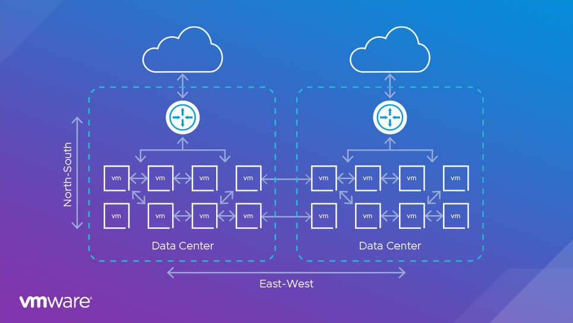

# Istio service-mesh

## What is service-mesh?

A service mesh is a software layer that manages communication between services in an application. It's made up of containerized microservices and network proxies called "sidecars".

## What is East West and North South Networking Traffic

North-South Traffic  
Definition: North-South traffic refers to the data flow between clients or external networks (outside the data center) and servers or resources inside the data center (or cloud).

Direction: Traffic moving in and out of the data center or cloud environment.

Typical Use Cases:

Client-server communication: When a user accesses a website, sends a request to an API, or retrieves data from a cloud-based service.

East-West Traffic  
Definition: East-West traffic refers to the data flow between different systems or components within the same data center or cloud environment. It’s internal traffic.

Direction: Traffic moving laterally between servers, microservices, virtual machines, or containers within the data center.

Typical Use Cases:

Microservices communication: In modern cloud-native applications, microservices frequently communicate with each other to process requests.  
Internal system processes: When one part of an application interacts with another part inside the data center (e.g., web server talking to a database server).

## Why to use Istio, what are benefit of using Istio?

Istio is a powerful open-source service mesh platform used to connect, secure, control, and observe services in a microservices architecture. It provides a wide range of features that help manage and secure service-to-service communication across modern distributed applications.

Advantages of using Istio:

mTLS: Istio provides mutual TLS connection between applications to communicate.

Traffic Management: Fine-grained control over service traffic with intelligent routing, load balancing, and failure recovery.

Security: Built-in security features, like mutual TLS, encryption, and authentication, for securing communication between services.

Observability: Provides deep visibility with tracing, monitoring, and logging of service-to-service traffic.

Policy Enforcement: Enforce policies like rate-limiting, quotas, and access control for services.

Resilience: Built-in fault tolerance features like retries, timeouts, and circuit breaking.

Service Mesh: Simplifies management of microservices by decoupling networking logic from application code, enhancing scalability.

## Workflow

Imagine you have three services, A, B, and C, deployed in your Kubernetes cluster. Each service has its own Envoy sidecar proxy.

Service A sends a request to Service B.

The request is first intercepted by Service A’s Envoy proxy, which forwards it to Service B’s Envoy proxy.

Service B’s Envoy proxy applies any traffic rules (e.g., retries, timeouts, load balancing) and sends the request to Service B.

Along the way, the request is authenticated using mTLS, encrypted, and checked against any security or authorization policies.

Metrics, logs, and traces are collected by both Envoy proxies, providing full visibility into the request.

If Service B is unhealthy or experiencing issues, Istio can automatically route traffic to a different instance of Service B or even roll back to a previous version using traffic routing rules.
